**Disclaimer**

*The views expressed in this publication are those of invited contributors and not necessarily those of their employers or of the Institute and Faculty of Actuaries. The Institute and Faculty of Actuaries do not endorse any of the views stated, nor any claims or representations made in this publication and accept no responsibility or liability to any person for loss or damage suffered as a consequence of their placing reliance upon any view, claim or representation made in this publication. The information and expressions of opinion contained in this publication are not intended to be a comprehensive study, nor to provide actuarial advice or advice of any nature and should not be treated as a substitute for specific advice concerning individual situations. On no account may any part of this publication be reproduced without the written permission of the Institute and Faculty of Actuaries*

**Acknowledgements**

We would like to thank all the members of the Pragmatic Stochastic Reserving Working Party who gave lots of interesting market insights and valuable contributions. In particular, we would like to explicitly thank:

 - James Orr, for reviewing the whole document and chairing the working party;
 - Jeremy Law, for his contribution to the ODP model section and for reviewing the whole document;
 - Kevin Chan, for reviewing the whole document;
 - Michael Ramyar, for reviewing the Monte Carlo simulation method section;
 - Nyasha Chipanga, for his contribution on the Mack's model section;
 - Nyasha Chiwereza, for her contribution to the Stochastic Reserving Process; and
 - Markus Gesmann for converting the original Word file into Markdown.

# Introduction and Scope

## Overview

### Scope

The aim of this document was encapsulated in the title of our working party: *The Pragmatic Stochastic Reserving Working Party*. Our ambition was to smooth the path for general insurance actuaries, regardless of experience, to engage with and understand the commonly used stochastic reserving methods. Our original scope also encompassed providing practical guidance to actuaries in relation to which methods to use and when, and we believe that we have made some progress towards achieving this.

Our target audience falls into two categories:

 - Actuaries tasked, through calculations and analysis, with assessing reserve variability;
 - More senior, experienced, actuaries with responsibility for the oversight and, most likely, review of such reserve variability assessments.

Recent years have seen a greater interest in and focus on economic and regulatory capital modelling, requiring quantification of the uncertainty attaching to unpaid claims reserves. Given the undoubted complexity and technical challenges of using stochastic reserving models, many senior actuaries in particular have needed to develop their skills and understanding of the different methods. As in other areas of actuarial practice, senior actuaries need to understand the main assumptions, drivers and limitations of methods, as well as having the breadth of perspective to be able to guide and review the detailed technical work of others.

Other actuaries, most likely younger career-wise and relatively less experienced, will be responsible for the detailed numerical work involved in reserving and reserve variability assessments. These actuaries will face the challenge of engaging with a substantial and sophisticated body of material. Also, the number of methods available is steadily increasing as new academic papers are published and new software is released. How best to catch up with and make sense of this rapidly expanding field?

To spare both the reader and authors, we have found it necessary to define a tight scope for this paper, to limit ourselves to a small number of commonly used stochastic reserving methods.

From the diverse and expanding range of available stochastic reserving methods, we have chosen to limit our scope to the following three:

 - Mack model
 - Over-dispersed Poisson model
 - Stochastic Bornhuetter-Ferguson

(These models are described in section [Models](#Models) so we direct those unfamiliar with them to that part of the paper).

These particular models have been chosen after due consideration of a number of factors, including use amongst practitioners, profile in the academic literature and ease of definition and initial application. However, it must be noted that the stochastic Bornhuetter-Ferguson method is not as well developed in the literature as the other two models. We have elected to include it here due to the usefulness of the BF method for long tailed lines of business where experience emerges slowly. Furthermore, we opted for a version of the Bornhuetter-Ferguson model with an underlying Over-dispersed Poisson model which does not require many parameters to be estimated via expert judgement; thus it is more suitable for use in bootstrapping which requires automation of model fit.

Furthermore, we have therefore limited ourselves to looking at the application of the methods to gross data, without allowance for reinsurance recoveries. We have also focussed on "Accident Year" data, instead of "Underwriting Year", accepting that the latter is in common use. Our main reason for this is to preserve the relative independence of the resulting claims cohorts, which is a common assumption within the methods.

We have also concentrated on an "ultimate" view of risk rather than a one-year view. Some further discussion of the meaning of each of these views and the rationale for considering the ultimate view only are given in section [Ultimate vs One-Year View of Risk](#Ultimate vs one-year view of risk).

Finally we have restricted our attention to the consideration to independent error which is amenable to quantitative measurement. Model error, or systemic risk which requires a more qualitative, judgemental approach, is out of scope of the paper. However, this scope limitation is not intended to imply that model error may be ignored. In many cases, it represents a material component of the overall prediction error. Some further discussion on this point may be found below in section [Sources of Uncertainty](#Sources of Uncertainty).

### Guide to the paper

The paper opens with some introductory comments on different views of risk, in particular the ultimate view and a one year view of risk, before electing to consider the ultimate view. We then describe the reserving framework in which the central estimate of risk and the measurement of uncertainty occur, including the sources of uncertainty that need to be considered in any quantification of risk.

Sections [Models](#Models), [Model Validation](#Model Validation) and [Estimating the Reserve Distribution](#Estimating the Reserve Distribution) contain the methodological part of the paper – introducing the reader to the three models under consideration, discussing model fitting, validation and uncertainty quantification using analytical formulae, bootstrapping and Monte Carlo simulation.

We illustrate the use of the various models for two example data sets in section [Numerical Examples](#Numerical Examples) while the last [section](#Conclusion) gives some concluding remarks.

As a number of acronyms are used in this paper, we have included a [glossary](#Glossary) for ease of reference.

# Ultimate vs One-Year View of Risk

As a starting point, we considered the definitions of the Solvency Capital Requirement and Non-life underwriting risk from the [Solvency II](https://eiopa.europa.eu/regulation-supervision/insurance/solvency-ii/solvency-ii-technical-specifications) technical specifications:

SCR.1.9: The SCR (Solvency Capital Requirement) should correspond to the Value-at-Risk of the basic own funds of an insurance undertaking subject to a confidence level of 99.5% over a one-year period.

SCR.9.1: Non-life underwriting risk is the risk arising from non-life insurance obligations, in relation to the perils covered and the processes used in the conduct of the business.

SCR.9.3: The non-life underwriting risk module takes account of the uncertainty in the results of undertakings related to existing insurance and reinsurance obligations as well as to the new business expected to be written over the following 12 months.

As we can see, there is not an explicit definition of Reserve Risk in the Technical Specifications. In order to get that, we must refer to the [Solvency II Glossary](http://ec.europa.eu/internal_market/insurance/docs/solvency/impactassess/annex-c08d_en.pdf)

**Claims Risk** An underwriting risk. A change in value caused by ultimate costs for full contractual obligations (claims without administration costs) varying from those assumed when these obligations were estimated. [...] Reserve risk only relates to incurred claims, i.e. existing claims, (e.g. including IBNR and IBNER), and originates from claim sizes being greater than expected, differences in timing of claims payments from expected, and differences in claims frequency from those expected.

Overall, if we consider all the above definitions together, we could summarise that the Reserve Risk is the result from fluctuations of claims settlement over a one-year period. This interpretation leads to some concerns around what should be considered as a "one-year period". Thus, in order to clarify it, in 2008 the [IAIS](http://www.iaisweb.org/view/element_href.cfm?src=1/5778.pdf) stated:

[...] **Shock period:** the period over which a shock is applied to a risk;

**Effect horizon:** the period over which the shock that is applied to a risk will impact the insurer.

In essence, at the end of the shock period, capital has to be sufficient so that assets cover the technical provision (...) re-determined at the end of the shock period. The re-determination of the technical provisions would allow for the impact of the shock on the technical provisions over the full time horizon of the policy obligations"

This definition led to the following two views for the Reserve Risk:

 - **Ultimate view:** the uncertainty due to all future payments $P(t)$; and
 - **One-year view:** the uncertainty of the Claims Development Result, i.e. the uncertainty of the payments which will occur during the year $P(1)$ plus the revaluation of the claims' reserve at the end of the year.

In mathematical terms, they are defined as follows:

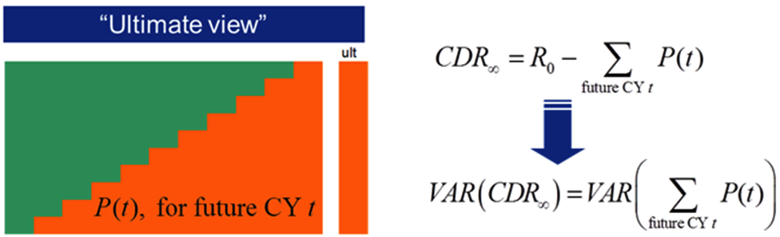

Where:

 -  $R_0$ is the opening reserve, and is known (i.e. $\mbox{V}(R_0)=0$, ;
 -  $P(t)$ are the payments during calendar year $t$, solely for claims already happened at the moment of evaluation $t=0$ (i.e., it is assumed that there is no new business);
 -  $R_t$ is the closing reserve after having observed  $P(1)$.

$\mbox{CDR}_t$ is the Claim Development Result after $t$ years from the instant of evaluation, i.e. the difference between actual and expected over the specified $t^{th}$ period. Ideally, if actuaries truly reserve at best estimate taking into account all the possible knowledge, the expected value of the CDR for any future $t$ at the instant of evaluation should be zero ("prospective CDR"). This is opposed to the "retrospective CDR", which is the observed CDR after $t$ years and thus not centred on zero. We recommend Wüthrich and Merz [[MW08](#MW08)] for further reading on this topic, as this paper is only concerned with the prospective view.

In summary, the "ultimate view" assesses all the possible reserve paths[^1]
until reserve run-off, whilst the "one-year view" assesses only the different paths over the first year and the resulting reserve an actuary would estimate after observing each of these one year paths (the process is frequently referred to as "actuary-in-the-box", i.e. a re-reserving algorithm). More discussion about "re-reserving algorithms" can be found in Ohlsson, Esbjörn and Lauzeningks [[OEL08](#OEL08)].

We have elected to focus on the ultimate view of risk in this paper as a clear understanding of this is a pre-requisite for tackling the problem of estimating the one-year risk. The one-year view reserving problem is a subject of ongoing work by the working party.

# The Stochastic Reserving Process

In this section, we discuss the reserving process, much of which will be familiar to many readers, but is helpful to include here to frame the discussion on the estimation of uncertainty. We open with a review of data requirement – the models discussed in this paper are dependent on good quality data to avoid the problem of "GIGO" (garbage in, garbage out). We discuss both deterministic and stochastic reserving processes, noting that deterministic methods, usually overlaid with judgement, are the most commonly used technique for reserve estimation. Consequently, when assessing variability, it is often necessary to align results from a deterministic estimation with those from a stochastic model and the section concludes with some pointers for how this may be accomplished.

Finally, we consider the sources of uncertainty in the reserve estimate; describing methods for measuring this uncertainty is the aim of this paper.

## Data

### Overview

Given our focus on numerical methods for assessing reserve variability, careful consideration should be given to the source, form, quality and quantity of data used. The methods considered in this paper make use of triangulated data, so the following comments relate to triangulated development data, to which the various models might be applied though many comments are also applicable to individual data. Equally, the comments are relevant to deterministic models, so most readers will routinely be familiar with such considerations. They are included for the sake of completeness. Additionally, stochastic models are often used in automatic fitting processes such as the bootstrap. With less scope to apply judgement to adjust results, it may be argued that data issues require greater attention.

Four areas of consideration relating to data are discussed briefly below:

**Source:** Actuaries should understand the following: where the triangulated data has come from; how this relates to business processes and how those processes have changed over time; how data capture has been controlled and managed over time; how the data has been collated from its granular form to arrive at the summary view of development over time. This knowledge can provide insights into limitations and features of the data, for example where past line of business categories have been combined or split.

**Form:** Being clear on the definition and treatment of data items, whether Paid, 'Reported but not Settled' (RBNS) or Incurred but not Reported (IBNR), the treatment of Salvage & Subrogation (S&S) and reinsurance recoveries. Also, assurance should be sought that data items are properly 'date stamped' and therefore captured correctly in different cells in the data triangle.

**Quality:** There is increasing recognition that data is a valuable business asset, which firms should manage carefully, whether preserving data from corruption, or protecting it from inappropriate use by external parties. The quality of data can also be defined and managed, with consequential benefits for firms in terms of operational effectiveness, efficiency in handling fewer errors and in reinsurance purchasing.

**Quantity:** Actuaries will also need to judge how much data is needed for the results to be credible: to have sufficient data to include features such as surges in claims frequency or inflation, or challenging market conditions placing a strain on bottom line results and levels of prudence in claims reserves. Data series for individual origin years should be long enough to include at least a single realisation of claims development 'to ultimate', leading to the conclusion that longer tail lines of business will require larger data triangles. If the data triangle does not include 'to ultimate' results, then tail-fitting procedures can be applied, although care should be taken to recognise the estimation uncertainty that will remain as a result of making these estimates.

### Statistical Credibility, Stationarity and Segmentation

Actuaries will seek a balance between collecting and using enough data to achieve statistical credibility; against using longer duration data that may incorporate effects, whether from the external environmental or changes in internal processes, which are markedly different from present and anticipated future experience. **Fundamental to all reserving and stochastic reserving methods is the assumption that future experience will be broadly in line with past experience, as reflected in the data but subject to adjustment for known and measured changes** - say in underlying exposures or in inflation if this is adjusted for separately within the modelling process. The assumption of future experience being the same as experience is sometimes referred to as the "stationary assumption". Although it is possible to arrive at a more stable, and potentially more credible, data set by combining triangles from a number of similar lines of business, **care should be taken to not combine heterogeneous sub-segments** where changes in the relative balance of these sub-segments might change over time, leading to features in the combined data that do not reflect the underlying experience.

For most purposes, **data should include claims costs** , but also **Allocated Loss Adjustment Expenses**. Also, if **Salvage & Subrogation** (S&S) are common features of the business line then careful consideration should be given to this. It should also be noted that the potential for negative development increments may undermine the applicability of some of the methods.

**Independence:** Each of the stochastic reserving methods assumes that (origin year) cohorts of claims are independent of each other. As such, it is necessary for the data to be provided and analysed on an Accident Year (AY) basis, although Underwriting Year (UY) data may be used if there is reasonable assurance that those UYs are independent - this would be more likely if large and catastrophic losses were first removed from the analysis, which then focussed on attritional losses only. If the claims cohorts are not independent then a fundamental assumption for the other methods will have been breached. These dependences might be reflected through the use of correlation assumptions in other simpler methods, as explained in section [Other Models](#Other Models).

Ideally, **the segmentation used should reflect how the business is being managed** , not least to allow meaningful discussions with the business areas in understanding and interpreting the data.

It is the working party's view that **segmentation can usefully be applied, as a minimum requirement, at the Solvency II segmentation,** as this is likely to map to the regulatory capital requirements, whether for standard formula appropriateness or internal model purposes, and it is likely to be in common use amongst market practitioners

### Treatment of Outliers

Generally speaking, all available data should be used where possible. However, outliers have the potential to greatly influence model results so due consideration needs to be given to whether this influence is appropriate or not. We would encourage the application of models with and without such outliers, to understand what impact they have on the results and to consider whether the underlying business might generate such extremes again in the future. In particular, outliers should only be removed outright if there is reasonable assurance that these are exceptional outcomes that cannot happen in the future.

**Large and catastrophic losses** can be a strong driver of overall results, including reserve variability, and will have an effect on reserving uncertainty. As such, natural catastrophes and significant man-made events should be included. However, if these are significant and have happened recently, these could lead to biased results, requiring judgements as to how much they should be reflected in the results. It may be necessary to remove data relating to these events from the model data if they have a large influence on the rest of the model. However, separate allowance must then be made for similar future events, both in terms of the central estimate and the levels of variability.

All adjustments to data should relate to specific and well-documented reasons to exclude small portions of the claims reserving triangle, e.g. a single accident period, or a single cell. Such reasons might include: poor data quality; claims management changes; underwriting policy changes; portfolio cleansing, etc., all of which have a clear impact on the data triangle.

### Data History

As mentioned above, the longer the development duration for the business, the more data will be needed. Suppose $d$ is the reserve duration. As a "rule of thumb"[^2]

 - the working party would recommend:
 - Minimum number of historical years =  $d\times 5$
 - Maximum number of historical years = $1.5\times d\times 5$

where we would consider a LoB as:

 - Short tail: $d \leq 2$
 - Normal: $2 < d \leq 4$
 - Long tail: $d > 4$

### Reinsurance

The view within the working party was that reserving variability analysis should be carried out using gross data. Three specific arguments supported this view:

1. Net data provide an incomplete view of the underlying volatility in experience, and systematically understate the potential downside risk, say if extrapolated to derive a capital requirement figure.

2. Reinsurance programmes may not respond (by design or through exhaustion) in the same way in the future as in the past.

3. For longer-tail lines of business, the impact of existing reinsurance could be poorly reflected in development to date (for example, under a 'Risk XL' programme protecting a liability book) leading to greater estimation error in the final result.

## Deterministic Reserving - Actuarial Best Estimate

Deterministic reserving has been used for many years to value general insurers' claims liabilities. Widely used methods include the Chain Ladder (CL) method and Bornhuetter-Ferguson (BF) method. The CL and BF methods form the basis of the starting points for some stochastic methods, which will be explained in this paper.

One of the advantages of deterministic methods is that they produce one answer (i.e. the Actuarial Best Estimate itself, or ABE) which is easy to understand and communicate to management. In addition, they usually allow the inclusion of external judgement/knowledge in the reserving evaluation in a fairly transparent way, as stochastic assumptions are not required.

The key weakness of deterministic methods is that they provide little understanding of the level of the uncertainty associated with the ABE. Scenario and sensitivity testing may provide some insight into reserve variability, but a complete picture of the volatility is not possible. For this, a stochastic model is required.

Ideally, the same (stochastic) model should be used for both the estimation of the ABE and its associated uncertainty to ensure that the uncertainty estimated is truly that of the ABE. However, it is a common market practice that an ABE is derived from the results of one or more deterministic models, overlaid by judgemental adjustments to reflect extraneous information not present in the data triangle. Many stochastic models do not readily lend themselves to these types of manual adjustments, so there are often sound actuarial reasons for this approach.

Therefore, common market practice uses deterministic methods for reserving, combining them later in the reserving process with results from the stochastic reserving exercise to derive estimates of uncertainty.

## Stochastic Reserving

Stochastic methods provide information about the reserve distribution: at least the first two moments, i.e. the mean and variance, but frequently the full distribution of reserves. This is achieved by setting some stochastic assumptions underlying the observed process, doing inference and then applying either an analytic or a simulation approach.

The key strength of stochastic methods is that they yield a wealth of statistical information which would not have been available from deterministic methods. This information can be used to give more insights to the senior management and to improve their decision making process. For example, an understanding of where the mean lies amongst the range of possible outcomes provides some insight into the degree of conservatism built into the reserves. Other useful output includes confidence intervals around a particular chosen mean, reserves at the extreme tails (e.g. 95% or 99%) and sensitivity analysis.

However, stochastic methods are subject to some drawbacks. They are data intensive, requiring historical data to parametrise the models. Sufficient data may not be available, or the environment may have changed meaning that past experience is no longer representative of future experience. It is also important to recognise that all results from a stochastic method are subject to model error (section [Sources of Uncertainty](#Sources of Uncertainty)) so must be interpreted with due care – for example, even with a large number of simulations, model error may mean that some key adverse scenarios may be missed. Furthermore, the proper use of stochastic methods usually requires a reasonable degree of technical skill.

As discussed in the previous section, actuarial judgement is often used to deal with cases where there is limited data, or to incorporate extraneous data and we noted that incorporating such judgemental adjustments may not be straightforward in stochastic models, though not necessarily impossible. For example, Bayesian methods may be used to combine objective data with more subjective option when estimating a reserve, though fitting an appropriate model may be difficult in practice. In cases where the actuary takes the view that future experience will unfold differently to the past, stochastic model parameters could be adjusted to reflect this, though the actuary would then need to consider the impact of any such adjustments on the uncertainty estimates.

As noted in the previous section, the common market practice is that stochastic methods are implemented alongside the deterministic ones. The stochastic results are reconciled to the deterministic results before the distributional information is used to estimate the uncertainty. This process is discussed in the next sub-section.

## Reconciling the Stochastic Best Estimate to the ABE

As the ABE and the stochastic reserving model frequently follow two different processes, it is likely that the former will differ from the Stochastic Reserving Best Estimate (SBE) (where the best estimate is defined as the central estimate, or the mean, of the stochastic distribution). This is usually due to the fact that it is easier to embed external business knowledge in the ABE than in the stochastic models, as the latter have stronger assumptions and are often less flexible. However, it is reasonable to expect the ABE and SBE to be in a reasonable range (to within approximately 10%), as the SBE should represent the uncertainty around the ABE process and thus be reasonably aligned to the ABE. In practice, this may be difficult to achieve, as the standard parametrisations of the most commonly-used stochastic methods (Over-dispersed Poisson model and Mack, refer to section [Models](#Models) for more details) have SBEs equal to the deterministic Chain Ladder (or Volume All DFM) estimate. In other words, the further the ABE is from a Chain Ladder estimate, the more it will usually differ from the SBE given current market practice. If the difference is material (e.g. >10%), it is recommended to consider either other stochastic methods that replicate better the methodology used for setting the ABE (e.g. the Stochastic Bornhuetter-Ferguson is often a useful alternative) or to change the GLM regression structure and assumptions underlying the stochastic models.

On the contrary, if the difference falls in a reasonable range, it is widely accepted practice to align the SBE to the ABE. This is usually achieved by shifting the reserve distribution using either an additive or multiplicative scaling. In a nutshell, additive scaling keeps the same standard deviation after scaling as before, whilst the multiplicative keeps the same CoV, as shown in the figures below.

As we can see, whilst the additive method shifts the distribution to the ABE keeping the same uncertainty, the multiplicative method stretches (shrinks) the uncertainty if the ABE is greater (lower) than the SBE. For this reason, common market approach recommends to adopt a conservative approach when shifting the distribution, i.e. apply the additive method if the ABE is less than or equal to the SBE and the multiplicative method otherwise.

More advanced techniques include considering the above for each accident year and – when the full (simulated) distribution is available – performing a simulation by simulation shift, but the overall concept is always to go for the more conservative option.

## Sources of Uncertainty

Let $Y_{ij}$ represent the random variable[^3] of interest relating to accident or origin period $i$ and development period $j$. Suppose that the true underlying model of $Y_{ij}$ is

$$
Y_{ij} = u(i,j;\theta) +\varepsilon_{ij}
$$

where $\theta$ is the set of model parameters and $\varepsilon_{ij}$ represents 
the stochastic error, centred on zero, i.e. $E[\varepsilon_{ij}]=0$.

In practice, as the model $u(i,j;\theta)$ is unknown the modeller will fit a different model with a different parameter set:

$$
Y_{ij} = \nu(i,j;\varphi) +\varepsilon_{ij}
$$

where the error term $\varepsilon_{ij}$ is now applicable to the actual model fitted.

The fitted values for this model are:

$$
\hat{Y}_{ij} = \nu(i,j;\hat{\varphi})
$$

where the hat symbol represents fitted values.

The prediction error of this model is $Y_{ij} \hat{Y}_{ij}$ which may be decomposed as:

$$
Y_{ij} - \hat{Y}_{ij} = \left[ \nu(i,j;\varphi) - \nu(i,j;\hat{\varphi}) \right]  + \left[ \varepsilon_{ij} \right] + \left[u(i,j;\theta) -  \nu(i,j;\varphi) \right]
$$

where each of the three bracketed terms corresponds to a different source of error, namely:

**Parameter error:** $\left[ \nu(i,j;\varphi) - \nu(i,j;\hat{\varphi}) \right]$. 
This represents the uncertainty in the parameter estimates assuming the model is correctly specified

**Process error:** $\left[ \varepsilon_{ij} \right]$. This represents the randomness in the future outcomes. Even if the model were correctly specified and the parameters correctly estimated, the volatility associated with the insurance process[^4] is likely to result in differences from the expected outcomes. In other terms, it's what is commonly called variance of a random variable.

**Model error:** $\left[u(i,j;\theta) -  \nu(i,j;\varphi) \right]$. This measures the difference between the parametric form assumed for the model and the true but unknown parametric form, i.e. the error introduced by the choice of model.

A simplified graphical representation of each of the three sources of error is 
given in Figures below.

#### Parameter Error

From the above figure we see that parameter error (or risk) represents the difference in mean values between the estimated distribution and the assumed distribution with true underlying parameters.

#### Process Error

Process error is depicted above. This represents the error caused by the actual future value differing from the mean of the assumed underlying distribution with the true parameters.

#### Model Error
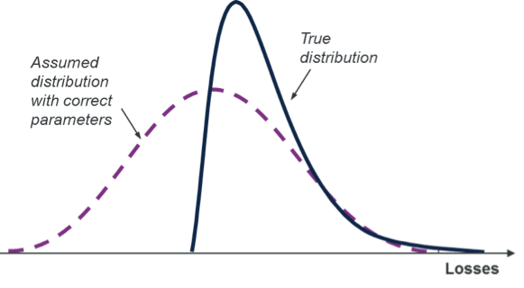

Model error is shown above, i.e. the error that the model is mis-specified. In this simple example, the true model is a log normal distribution but the assumed distributional form is normal.

Parameter and process error are the two components of **independent risk** – i.e. those risks that arise from the inherent randomness in the insurance process.

Model error corresponds to **systemic risk** , i.e. risks that impact a lot of claims, or a number of valuation groups or even all claims. Examples of systemic risk include legislative or other environmental changes or claims process changes that impact the number and settlement size of claims. The emergence of latent claims, binary events and ENIDS (Events Not in Data) are all components of systemic risk.

Since model error involves the true _unknown_ underlying distribution, its quantification is difficult. There is no known procedure for its estimation by reference just to the data relied on by the modelling. However, there have been some attempts to quantify model error from data and opinions external to the data set. O'Dowd et al [[OSH05](#OSH05)] and subsequently the Risk Margins Taskforce (Actuaries' institute, Australia) [[RMT08](#RMT08)] set out a process to tackle this issue by:

 - Identifying the major potential causes of model error
 - Scoring each subjectively for its likely impact
 - Mapping the scores to a quantitative measure of error such as a coefficient of variation

Combining these measures with the equivalent for parameter and process error produces an overall estimate of prediction error.

The agreed scope for this paper was to consider parameter and process error only (i.e. independent risk). Thus model error (or systemic risk) will not be discussed in detail here. However, this should not be taken as a statement that model error is of lesser importance. In many cases it will represent a material, possibly even dominant, proportion of prediction error. Therefore, it must be considered by the actuary.

The Solvency II standards say the following regarding model error:

SCR.1.23 Undertakings are not required to quantify the degree of model error in quantitative terms, or to re-calculate the value of the capital requirement using a more accurate method in order to demonstrate that the difference between the result of the chosen method and the result of a more accurate method is immaterial. Instead, it is sufficient if there is reasonable assurance that the model error included in simplification is immaterial.

So there is an onus on the actuary to satisfy themselves that their selected form of variability estimation adequately captures the main sources of error. Section [Model Validation](#Model Validation) contains information to help the actuaries in this sense, giving an overview of the techniques that can be used to validate model assumptions.

## Measures of Reserve Uncertainty

A commonly used measure of prediction error is the **mean square error of prediction** (MSEP). In the case of a reserve estimate, the MSEP is the expected value of the square of the total reserve error (see, e.g. [[TM15](#TM15)]). In cases where the parameter and process errors are stochastically independent, the MSEP may be decomposed into the sum of the squares of the parameter and process errors.

It is also common to use a **coefficient of variation** (CoV) to express reserve uncertainty. A CoV is defined as a standard deviation or standard error measure divided by a central estimate. In the reserving case, the numerator is the **root mean square error of prediction** (i.e. the $\sqrt{\mbox{MSEP}}$ or RMSEP) and the denominator may either be the ultimate loss reserve or the outstanding claims reserve.

# Models

In this section we describe each of the three models considered in this paper. The three models are Mack's model, the Over-dispersed Poisson model, and a stochastic Bornhuetter-Ferguson model. We briefly describe the historical development of each model, and the assumptions made by each of the models. We also discuss the analytic calculation of the MSEP for each model. Throughout we attempt to give intuitive explanations so that the reader will develop a sound understanding of how each model works and what its strengths and limitations are. Finally we have a subsection discussing other models that could be used if the three models presented are not suitable.

## Mack's Model

### Introduction

The Chain Ladder is the most widely used claims reserving method. Taylor [[Ta86](#Ta86)] traces its lineage back as far as Harnek [[Ha66](#Ha66)]. According to Taylor ([[Ta00]](#Ta00)) section 2.2.4) the name Chain Ladder "is understood to refer to the chaining of a sequence of ratios (the age to age factors below) into a ladder of factors (the age to ultimate factors below) which enable one to climb (i.e. project) from experience recorded to date to its predicted ultimate value." The method was originally developed as an intuitively appealing procedure for computing reserve estimates, and only afterwards was thought given to whether there was a stochastic model underlying the method.

It was recognised quite early by Hachemeister and Stanard [[HS75](#HS75)] that a Poisson distribution assumption for incremental claim numbers leads to the same reserve estimates as the Chain Ladder method. This insight may be seen as a precursor of the over-dispersed Poisson model described in the following section. Several other attempts were made to specify a stochastic model which gave the same reserve estimates as the Chain Ladder method (see [[Ma93b](#Ma93b)], [[Ta00](#Ta00)] section 2.2.4 and chapter 7, and the references therein). However, none of these models successfully reproduced the Chain Ladder estimates exactly. In 1993 Mack [[Ma93a](#Ma93a)] proposed a distribution-free stochastic model which reproduced the reserve estimates of the Chain Ladder method exactly, and within this model he derived analytic formulae for the mean squared error of the reserve estimates. Because the model reproduces the reserve estimates of the Chain Ladder method exactly and it makes no assumptions about the underlying distribution of claims amounts, it has become one of the most popular stochastic models for claims reserves. It is this model that is described in this section.

The deterministic basic Chain Ladder method involves calculating development factors (i.e. age to age factors) which are then applied to the latest cumulative claim amounts in the claims development triangle to estimate the ultimate claim amounts. The development factors are calculated as the volume weighted average of the individual development factors. Mack shows that, within his model, this calculation gives unbiased estimators for the development factors, and that applying the estimated development factors to estimate the ultimate claims gives an unbiased estimate of the ultimate claims. He thus provides justification for the heuristic calculations of the basic Chain Ladder.

One way of viewing Mack's method and the Chain Ladder which can be helpful, but which should not be taken too literally, is to think of the Chain Ladder as fitting a weighted regression model on the triangle's development factors, with the weights being given by the cumulative claims amounts. This is because the basic Chain Ladder calculation of the development factors is just the weighted average of the individual development factors. The basic Chain Ladder development factors may then be thought of as the "fitted" or systemic part of our regression, while the difference between these fitted development factors and the individual development factors can be seen as "noise". In much the same way as the distribution of the noise or error terms in a regression model gives the distribution of the prediction, we can estimate the variability of the Chain Ladder prediction by investigating the errors between the fitted and actual development factors.

As noted above, it is advised that this way of thinking about Mack's model should not be taken too literally. The standard linear regression model assumes that the explanatory variables are known with certainty, and only the dependent variables are stochastic. However if we interpret the calculation of the Chain Ladder development factors as a regression both the explanatory and the response variables are stochastic, thus violating the assumptions of the standard linear regression model. Therefore, the parameter and standard error estimates implied by the standard linear regression model are not correct. As will be seen below, Mack gets around this problem by using conditional expectations in his model assumptions; the use of conditional expectation in the assumptions is essential for ensuring that the estimates of the parameters and the standard errors are correct.

### Assumptions

As with the basic Chain Ladder, Mack's model takes as input a triangle of cumulative claims. This could be a paid claims triangle or an incurred claims triangle. We denote origin periods by $i$ and development periods by $j$. For ease of exposition we will assume that the triangle of claims is "regular" in that the number of origin periods is equal to the number of development periods, although the model can work with "irregular" triangles of claims data. We assume that there are $n$ origin periods, and $n$ development periods. We denote the cumulative claims amount for origin period $i$ and development period $j$ by $C_{ij}$. The triangle of claims data that we have is therefore:

$$
\left\{C_{ij} ∶ i = 1,\dots,n, \;j = 1, \dots ,n-i+1 \right\}
$$

Mack's model makes the following assumptions:

1. For each $j = 1, \dots ,n-1$ there are development factors $f_j$ such that 
$E[C_{i, j+1} | C_{i1}, \dots , C_{ij}] = C_{ij} f_j;$
2. Origin periods are independent i.e. for each $s \neq t$ ,  
$\left\{C_{s1}, \dots, C_{sn}\right\}, \left\{C_{t1}, \dots, C_{tn}\right\},$ are independent.

Mack shows that, with the above assumptions, the basic Chain Ladder estimators for ultimate claims and the reserve are both unbiased estimators ([[Ma93a]](#Ma93a), section 2). Note that the model assumes that the origin periods are independent. A triangle with accident origin periods is most likely to fulfil this assumption.

To allow a calculation of the mean squared error of prediction (MSEP), Mack made the following additional assumption:

3. For each $j = 1, \dots, n-1$ there are parameters $\sigma^2_j$  such that 
$Var[C_{i,j+1}|C_{i,1}, \dots , C_{ij}] = C_{ij} \sigma^2_j$.

Using these three assumptions Mack derives formulae for the mean squared error of the reserve for each individual origin period and for the total reserve across all origin periods. Refer to [MA93a] for the details.

### Analytic Calculation of MSEP

Mack derives analytic formulae for the MSEP for the reserve estimates of individual origin periods, and for the total reserve across all origin periods. The MSEP consists of the parameter error and the process error (section [Measures of Reserve Uncertainty](#Measures of Reserve Uncertainty)). Recall from section [Sources of Uncertainty](#Sources of Uncertainty)) that parameter error is the error due to the fact that the parameters are estimated from a limited set of data, and therefore unlikely to be equal to the "true" underlying parameters, while process error is the error somehow inherent in the underlying process producing the claims data. The parameter error arises from fitting the model to the given claims triangle, the process error arises from projecting from the given claims data to estimate the ultimate claims amounts. In assumption (2) Mack assumes that the origin periods are independent. It follows from this that the process errors for different origin periods are independent. However the parameter errors for two different origin periods are both based on the same estimated parameters, and so are correlated. Therefore the reserve estimates for different origin periods are correlated, and this needs to be taken account of when calculating the MSEP of the total reserve estimate across all the origin periods.

We now describe the formula for the process error component of the MSEP for an individual origin period. The process error is governed by the parameters $\sigma_j^2$ introduced in assumption (3). The first step is therefore to estimate these parameters. Mack does this using the following formula:

$$
\sigma_j^2=\frac{1}{(n-j-1)} \sum_{i=1}^{n-j} C_{ij} \left(f_{ij} - \hat{f}_j\right )^2
$$

Where the $f_{ij}$ are the individual development factors:
$$
f_{ij}=\frac{C_{i,j+1}}{C_{ij}} 
$$

Recall the loose interpretation of Mack's method as fitting a weighted regression model to the development factors. With this interpretation, the formula for $\hat{\sigma}_j^2$ is analogous to the usual unbiased estimator of variance of the errors in the normal weighted linear model, where the weights are the  $C_{ij}$.

There is a problem with the formula for $\hat{\sigma}_j^2$ above. It is only valid for 
$1 \leq j \leq n-2$  and so cannot be used to estimate the variance parameter 
$\sigma^2_{n-1}$ for the final development period. Fundamentally this happens because for the final development period there is only one individual development factor, and so it is impossible to estimate a variance parameter. Mack gets around this in an ad hoc and rather unsatisfactory way, by using the following value as an estimator:

$$
\hat{\sigma}_{n-1}^2= \mbox{min}\left(\frac{\hat{\sigma}_{n-2}^4}{\hat{\sigma}_{n-3}^2}, \mbox{min}\left(\hat{\sigma}_{n-3}^2, \hat{\sigma}_{n-2}^2 \right)\right)
$$

Mack justifies this as an exponentially decreasing extrapolation of the series 
$\sigma_1^2, \dots, \sigma_{n-2}^2$.

Mack's estimator for the process error component of the MSEP for the reserve estimator for a single origin period is then:
$$
\hat{C}_{in}^2 \sum_{j=n+1-i}^{n-1} \frac{\hat{\sigma}_j^2}{\hat{C}_{ij}\,\hat{f}_j^2}
$$

Mack's estimator for the parameter error component of the MSEP for the reserve estimator for a single origin period has a similar form:

$$
\hat{C}_{in}^2 \sum_{j=n+1-i}^{n-1} \frac{\hat{\sigma}_j^2}{\sum_{m=1}^{n-m}\hat{C}_{mj}\,\hat{f}_j^2}
$$

Summing these two terms gives the total MSEP for the reserve estimator for an individual origin period ([[Ma93a](#Ma93a)] theorem 3):

$$
\mbox{MSEP}(\hat{R}_i) = \hat{C}^2_{in} \sum_{j=n+1-i}^{n-1} \frac{\hat{\sigma}^2_j}{\hat{f}_j^2}
\left(\frac{1}{\hat{C}_{ij}} + \frac{1}{\sum_{m=1}^{n-j} C_{mj}}\right)
$$

Now consider the MSEP for the total reserve estimator. As discussed above, to calculate this we need to allow for the fact that the reserve estimators for the individual origin periods are correlated due to the fact that they rely on the same estimated parameters $\hat{f}_j$ and $\hat{\sigma}_j^2$  . The basic structure of the total reserve MSEP is the sum of the MSEPs for the individual origin periods plus an allowance for the correlation between the estimators. The formula given by Mack is ([[Ma93a](#Ma93a)] corollary to theorem 3):

$$
\mbox{MSEP}(\hat{R}) = \sum_{i=2}^n \left(\mbox{MSEP}(\hat{R}_i) + 2\hat{C}_{in}
\left( \sum_{m=i+1}^n \hat{C}_{mn} \right) \sum_{j=n+1-i}^{n-1} \frac{\hat{\sigma}_j^2}{\sum_{m=1}^{n-j} C_{mj} \, \hat{f}_j^2} \right)
$$

## Over-dispersed Poisson model

### Introduction

In section [Mack's Model](#Macks Model) above, we discussed the development of stochastic models of the Chain Ladder. We noted that it was recognised quite early by Hachemeister and Stanard [[HS75](#HS75)] that a Poisson distribution assumption for incremental claim numbers leads to the same reserve estimates as the Chain Ladder method, and that this insight may be seen as a precursor of the over-dispersed Poisson (ODP) model.

Hachemeister and Stanard's Poisson model is described in detail by Wüthrich and Merz [[WM08](#WM08)], section 2.3. It is a model of incremental claims numbers by origin period and development period, and assumes that these are independent and have a Poisson distribution. It assumes that the mean number of incremental claims for each origin period and development period is the product of an origin period parameter and a development period parameter. The parameters are estimated using maximum likelihood estimation. The estimated parameters can then be used to estimate the incremental claims numbers for future development periods for each origin period. The estimates thus obtained are identical to the estimates obtained by applying the basic Chain Ladder method.

A Poisson distribution is subject to some limitations: it only takes non-negative integer values, and the variance is always equal to the mean. The ODP model is a generalisation of the Poisson model and overcomes many of the limitations while retaining the same basic structure and the desirable feature that the reserve estimates are identical to those obtained using the basic Chain Ladder method.

The over-dispersed Poisson distribution allows the variance to be different from the mean, and permits non-integer values. The restriction to non-negative values takes the much weaker form that only the column totals must be positive in the triangle of incremental claim amounts, but note that this implies that the expected value of the incremental claims amounts cannot be negative, which might be undesirable in certain cases. The basic structure of the over-dispersed Poisson model ("ODP") is the same as the original Poisson model – the mean of the incremental claims amounts is assumed to be the product of an origin period parameter and a development period parameter. As the variance can be different from the mean a variance assumption is also needed. The ODP model assumes that there is a scale parameter such that the variance of the incremental claims amounts is equal to the mean times the scale parameter. The scale parameter may either be constant, or allowed to vary by development period. In practice it is usually more appropriate to allow the scale parameter to vary by development period, but here, for ease of exposition, we assume that the scale parameter is constant.

The ODP model was introduced by Renshaw and Verrall [[RV98](#RV98)]. They presented the model as a Generalised Linear Model (GLM). The GLM framework is an established and flexible framework for statistical modelling (See McCullagh and Nelder [[MN89](#MN89)] for a book length treatment of GLMs). Using GLMs has the advantage that there are many related alternatives and extensions that could be tried if the basic ODP model is found to be inadequate. For example, calendar period parameters could be added to the linear predictor to allow for calendar period trends such as inflation explicitly, or incremental claims could be assumed to be distributed differently, say following another distribution from the Tweedie family such as the gamma. Refer to Taylor and McGuire [[TM15](#TM15)] for examples of some of these extensions.

The Mack and the ODP model both give exactly the same estimates of the reserves as the basic Chain Ladder method. However they are two distinct models. In particular they give different estimates of the mean squared error of prediction. See Mack and Venter [[MV00a](#MV00a)] for a detailed discussion of the differences.

### Assumptions

Let $P_{ij}$ denote the incremental paid claims amount for origin period  and development period  . The ODP model assumes that there are origin period parameters $x_1, \dots, x_n$ and development period parameters $y_1, \dots, y_n$ such that

$$
E[P_{ij}] = x_i y_j
$$

With the further assumption that
$$
\sum_{j=1}^n y_j = 1,
$$

the origin period parameters $x_i$ may then be interpreted as the unconditional expected ultimate claims amount for the relevant origin period, and the development period parameters $y_j$ may be interpreted as the expected incremental development proportion for the relevant development period.

By the ODP distributional assumptions,

$$
\mbox{Var}(P_{ij}) \phi_{ij} E[P_{ij}]
$$

It is common to make simplifying assumptions for the scale parameters, $\phi_{ij}$. A common simplification is that the scale parameter varies by development period only. In this case we would assume that there are scale parameters $\phi_1, \dots, \phi_n$ such that

$$
\mbox{Var}(P_{ij}) \phi_{j} E[P_{ij}]
$$

A further simplification would assume that the scale parameter is constant, i.e.

$$
\mbox{Var}(P_{ij}) \phi E[P_{ij}]
$$

In practice, the scale parameter may often vary by development period. However, for the purpose of this paper, we assume, for ease of exposition, that the scale parameter is constant (also as noted in Taylor and McGuire [[TM15](#TM15)], a constant scale parameter will ensure that an ODP model set up as a GLM will yield the conventional Chain Ladder estimates as maximum likelihood estimates).

Renshaw and Verrall [[RV98](#RV98)] express the ODP as a Generalised Linear Model (GLM). GLMs generalise linear regression by allowing error distributions other than the normal distribution and allowing the response variable to be a function (called the link function) of a linear combination of the explanatory variables. The class of distributions considered by GLMs is the exponential family of distributions. This family includes many common distributions such as the normal distribution, the gamma distribution, the Poisson distribution and several others (McCullough and Nelder [[MN89](#MN89)]).

As described above, the ODP model assumes that the mean of the incremental claims amounts has a multiplicative structure. Therefore, by taking logs this may be transformed into a linear structure. Considered as a GLM, the ODP model has:

 - A log link function
 - Over-dispersed Poisson as the error distribution
 - $\log(E[P_{ij}])= \alpha_i + \beta_j$, or equivalently, $\mu_{ij} = E[P_{ij}] = \exp\left(\alpha_i + \beta_j\right)$, 
 - $\mbox{Var}(P_{ij}) \phi \mu_{ij}$ (assuming a constant scale parameter as discussed above).

Note that by using a log link function, it is necessary to assume that $E[P_{ij}] >0$. This requirement means that the ODP model is not suitable for data-sets where negative expected increments are material.

The Poisson model of Hachemeister and Stanard estimated the parameters using maximum likelihood. The parameters of a GLM are estimated using the more general procedure of maximising the quasi-likelihood. This permits the generalisation of the Poisson model by using a quasi-likelihood of similar form to the Poisson distribution but with a scale parameter $\phi \geq 1$ (note that the Poisson model may be interpreted as a special case of this generalised form where the scale parameter of 1, i.e. the mean is equal to the variance). This results in the over-dispersed Poisson distribution, which allows some negative values, and non-integer values.

Although estimating the parameters of a GLM can, in general, be quite complicated, for the ODP model described above, the parameters $x_i$ and $y_j$  can be estimated using the Chain Ladder method. This, together with the assumption that the expected incremental claims amounts are positive, implies that the column sums of the incremental claims triangle must be positive, so for every development period $j$ we must have

$$
\sum_{i=1}^{n-j+1} P_{ij} \geq 0
$$

The scale parameter can be estimated using the formula

$$
\phi =  \frac{1}{d} \sum_{i=1}^n \sum_{j=1}^{n-i+1} \frac{\left( P_{ij} - E[P_{ij}] \right)^2}{E[P_{ij} ]}
$$

Where d denotes the degrees of freedom and is calculated as the number of observations minus the number of parameters fitted. The number of observations is the number of $P_{ij}$ in the triangle of incremental claims. In a regular complete triangle with $n$ origin periods this is $\frac{n \left(n+1\right)}{2}$. The number of parameters fitted is the number of $x_i$ parameters plus the number of $y_j$  parameters minus one (because we have imposed the condition that $\sum y_j =1$  ). If we would like the scale parameter to vary by development period then the sum above would only vary over the origin period dimension for a fixed development period, and the number of degrees of freedom would also be amended accordingly.

Alternatively, the ODP model may be fitted using GLM software (see, e.g., Taylor and McGuire [[TM15](#TM15)]). Furthermore, the GLM framework allows other distributions to be considered which may be more appropriate for the claims data (Renshaw and Verrall [[RV98](#RV98)]).

It is worth noting that the ODP distribution is a special case of a Tweedie distribution, which was introduced by Tweedie [[Tw84](#Tw84)]. A characteristic of a Tweedie distribution is that the variance is proportional to $\mu^p$ where $\mu$ is the mean and  $p \leq 0$ or $p\geq1$ . Members of the Tweedie family include the Poisson distribution ($p=1$), the Normal distribution ($p=0$) and the Gamma distribution ($p=2$). Models using all these distributions may be fitted using GLM software (quasi-likelihood is used for the ODP and for non-integer $p$). Tweedie models are of particular interest when validating the distribution assumptions in reserving problems: for example, Jorgensen and Paes de Souza [[JP94](#JP94)] showed that Tweedie models with $1 \leq p \leq2$ can be identified as compound Poisson distributions with Gamma severity distributions. In practical terms, higher values of $p$ correspond to heavier tailed distributions. Therefore, if ODP model validation (discussed later in section [Model Validation](#Model Validation)) suggests that the data is heavier-tailed than the ODP distribution, then a Tweedie distribution with $p \geq 1$ could be considered as an alternative. For further discussion on this, including estimation of a suitable value for $p$, refer to [[PSW09](#PSW09)] and [[CGMWZ15](#CGMWZ15)].

### Analytic Calculation of MSEP

We now discuss the calculation of the MSEP of the reserves in this model. We discuss the MSEP for the reserve for an individual origin period, and for the total reserves over all the origin periods. As with the Mack and stochastic Bornhuetter-Ferguson methods, the MSEP can be broken down into different components. We break the MSEP for the ODP model into the same components as for the Mack, i.e. into the process and parameter error. We do not present the formulae for the calculations of the MSEP as shown by England and Verrall [[EV02](#EV02)]; instead we attempt to give an intuitive explanation of the different components and present a numerical example to aid understanding, leaving the technical details to [[EV02](#EV02)].

The process error is calculated as the square root of the (fitted) scale parameter times the reserve. Because the process error is an increasing function of the reserve, and we would generally expect the reserve to decline as the origin periods get older, we would therefore generally expect the process error to decline as the origin periods get older.

The calculation of the parameter error is more complicated. However we can make a few comments about how it is likely to behave. The parameter error increases approximately linearly with the reserve and with the scale parameter. As with the process error we would therefore expect the parameter error to decline as the origin periods get older. However the effect will be complicated as the relationship is only approximately linear.

Note, however, that rather than using analytical formulae, it is usually easier to use bootstrapping and Monte Carlo simulation to yield a reserve distribution. Details of this approach are discussed in section [Estimating the Reserve Distribution](#Estimating the Reserve Distribution).

## A Stochastic Bornhuetter-Ferguson Model

### Introduction

The Bornhuetter-Ferguson (BF) method was proposed by Bornhuetter and Ferguson in 1972 (see [[BF72](#BF72)]). It is widely used in actuarial work, particularly for lines of business with limited or no experience for recent origin periods. The basic idea of the method is to calculate the reserve as a proportion of a prior estimate of the ultimate claims. The usual practice is to use the proportions implied by the Chain Ladder development factors, although this is not a logical necessity of the method.

It is comparatively recently that attempts were made to specify a stochastic model consistent with the method described by Bornhuetter and Ferguson, and which could justifiably be called a Stochastic BF model. In 2000, Mack [[Ma00](#Ma00)] studied Benktander's method which is an intuitive credibility mixture of the BF method and the Chain Ladder. In this paper he described a very simple stochastic model and derived formulae for the prediction error for all three methods within this model. In 2004, Verrall [[Ve04](#Ve04)] studied how the BF method could be written in terms of Bayesian models within the framework of generalised linear models. The models are implemented using a Markov Chain Monte Carlo approach (i.e. using simulations) and so no analytic formulae for prediction errors are given. Mack [[Ma08](#Ma08)] described a stochastic model consistent with the BF method. He derived formulae for the fitted parameters, and the prediction error of the reserve. However in this model the proportion applied to the prior estimate of ultimate to calculate the reserve is different from that implied by the Chain Ladder factors, and the model is therefore not consistent with how the BF model is used in practice. In 2009 Alai, Merz and Wüthrich [[AMW09](#AMW09)] used the over-dispersed Poisson model to derive a stochastic model consistent with the BF method and where the reserve is equal to the proportion of the prior estimate of the ultimate claims implied by the Chain Ladder development factors. Within this model they derived formulae for the mean squared error of prediction (MSEP) for the reserves. The following year in [[AMW10](#AMW10)] they derived significantly simplified formulae. It is this latter model that we describe in this section.

The stochastic BF model that we describe is based on the ODP model. In this section we assume that the reader understands the ODP model as described in the section [Over-Dispersed Poisson Model](#Over-Dispersed Poisson Model) above. We start by reviewing the classical deterministic BF method. We then describe the assumptions for the stochastic BF model and attempt to give an intuitive explanation of the calculation of the MSEP for the reserves.

The basic idea of the BF method is to calculate the reserve for each origin period as a proportion of a prior estimate of the ultimate claims. The prior estimate is an input to the model and could incorporate information from underwriters, premium calculations or strategic business plans. The key thing is that it is independent of the claims data for the origin period. The proportion applied to the prior estimate of the ultimate claims is, in practice, usually derived from the basic Chain Ladder factors. It is perfectly possible to use other factors, but Alai, Merz, and Wüthrich's model assumes that the Chain Ladder factors are used.

We can express the deterministic BF method symbolically as follows. Let $i$ denote the origin period, and let $\nu_i$ denote the prior estimate of the expected value of the ultimate claims for origin period $i$. Let $j$ denote development period, and suppose that $f_j$ denotes the basic Chain Ladder development factor for development period $j$. Then the cumulative development proportion for development period $j$, denoted $\beta_J$ is given by:

$$
\beta_j = \prod_{k=j}^{n-1} \frac{1}{f_k}
$$

Let $C_{i, n-i}$ be the latest observed cumulative payment for the origin period $i$. The BF estimate of the ultimate claims is then given by:

$$
U_i^{BF} = C_{i, n-i} + \left(1 - \beta_{n-i} \right) \nu_i
$$

This formula leads to an alternative view of the BF estimate of the ultimate claims as a weighted average of the basic Chain Ladder estimate and the prior estimate of the ultimate claims:

$$
U_i^{BF} = C^{CL}_{i, n-i} \cdot \beta_{n-i} + \left(1 - \beta_{n-i} \right) \nu_i
$$

This is the case because the basic Chain Ladder estimate of the ultimate claims is given by

$$
C^{CL}_{i, n-i} = C_{i, n-i} \prod_{k=n-i}^{n-1} f_k
$$

and so

$$
C_{i, n-i} = \frac{C^{CL}_{i, n}}{\prod_{k=n-i}^{n-1} f_k } = C^{CL}_{i, n} \cdot \beta_{n-i} 
$$
Generally $\beta_{n-i}$ is larger for older origin periods, and smaller for more recent origin periods. Therefore, for the older origin periods more weight is given to the basic Chain Ladder estimate, and for more recent periods more weight is given to the prior estimate of ultimate claims. Below, when we look at the prediction error in the BF estimate of the reserves, we see a similar pattern. For the older periods the contribution to the prediction error of the prior estimate of the ultimate claims is relatively small, whereas for the more recent periods the contribution to the prediction error of the prior estimate of the ultimate claims is relatively larger.

The BF method is particularly useful when modelling long-tailed lines of business. For these lines the Chain Ladder method can often give unreasonable results for the more recent origin periods. The BF method mitigates this problem by giving more weight to the prior estimate of the ultimate claims, and less weight to the Chain Ladder estimate of the ultimate claims. When we look at the prediction error in the estimate of the reserves we see a similar pattern. In long-tail lines of business, in cases where the Chain Ladder estimate of the ultimate claims is unreasonable, the stochastic Chain Ladder models can often give very large estimates of the prediction error. It is important to note that in such cases, that whilst the best estimate is unreasonable, it is actually quite reasonable to have a large prediction error. When we apply the BF method to such cases we find that we get a much more reasonable estimate of the ultimate claims admittedly based on our prior view, and a smaller value for the prediction error. We see this in the application of the different models to data set 2 in section [Example 2](#Example 2).

### Assumptions

We now describe the assumptions made for the stochastic BF model being considered here. The model is based on the [ODP model](#Over-dispersed Poisson Model), so makes the same assumptions for the incremental claims amounts $P_{ij}$  with some additional assumptions for the prior estimates of the ultimate claims. The additional assumptions are:

- The prior estimates $\nu_i$  of the ultimate claims, are independent random variables that are unbiased *a priori* estimators of the expected value of the ultimate claims $C_{in}$ for all $i=1,\dots,n$; and
-  $P_{ij}$ and $\nu_i$ are independent for all $i,j$ .

So, in addition to the assumptions of the ODP model, we assume that the prior estimates are independent of the claims data and are unbiased estimators of the ultimate claim amounts.

In the above we only assume that the prior estimates $\nu_i$ of the ultimate claims are independent random variables. For the calculation of the BF estimates of the ultimate claims we require estimates of the mean, and for the MSEP we need to have estimates of the variance of these random variables. We assume that these are given exogenously. Note that, as $\nu_i$ is an estimate of the expected value of the ultimate claims, its variance is a measure of the uncertainty in the estimate of the mean, it is not the uncertainty of the ultimate claims themselves.

The assumption that the prior estimates $\nu_i$ are independent might not be realistic. For example there might be a systematic bias caused by the assumptions made for some relevant factor (e.g. future inflation assumption) turning out to be materially incorrect in hindsight.

### Analytic Calculation of MSEP

We now discuss the calculation of the MSEP of the reserves in this model. As with Mack's model and the ODP model, the MSEP can be broken down into different components. For Mack's model and the ODP model the components are the process and parameter error. For Alai, Merz and Wüthrich's stochastic BF model we introduce a third category - the error due to the prior estimate of ultimate claims. This could be considered part of the parameter error but it gives more insight into the overall MSEP to consider it separately.

The formulae for calculating each of these components is described in detail in [[AMW10](#AMW10)]. We now attempt to give an intuitive explanation of the different components.

As described above the three categories of error are: process error, parameter error and prior estimate error. The stochastic BF model presented here is based on the ODP model, so we can compare the process and parameter error between the two models.

The process error is calculated in exactly the same way for both models - it is the square root of the scale parameter times the reserve. The scale parameter is the same for both models, but the reserve is different, as the BF reserve is a proportion of the prior estimate of the ultimate claims. The ratio of the process errors calculated will therefore be fully explained by the ratio of the square roots of the estimates of ultimate claims. For example if, for a particular origin period the prior estimate of ultimate claims is 21% higher than the chain-ladder estimate of ultimate claims, then, because the square root of 1.21 is 1.1, the process error for the stochastic BF model would be 10% higher than the process error for the ODP model. Because the process error is an increasing function of the reserve, and we would generally expect the reserve to decline as the origin periods get older, we would therefore generally expect the absolute amount of process error to decline as the origin periods get older.

The calculation of the parameter error is more complicated than the calculation of the other two components. However we can make a few comments about how it is likely to behave. The parameter error increases linearly with the prior estimate of the ultimate claims. It also increases linearly with the scale parameter. The parameter error for an individual origin period also depends on the cumulative development proportion. For a long-tail class the most recent origin periods will have a small cumulative development proportion, and so the estimate of the reserve will be mostly determined by the prior estimate of the expected ultimate claims. In these cases the parameter error will also be relatively small (although the prior estimate error will be relatively large).

The prior estimate error is specific to the BF model. For each origin period it is calculated as the coefficient of variation of the prior estimate of the ultimate claims times the BF reserve. The total prior estimate error is calculated as the square root of the sum of squares of the prior estimate errors for the individual origin periods. The prior estimation error for individual origin periods is a linear increasing function of the BF reserve. Compare this with the process error which increases with the square root of the BF reserve. We would therefore generally expect the prior estimate error to decline as the origin periods get holder, and we would expect the rate of decline to be faster than for the process error. However the effect will be complicated by any differences in the estimate of the CoV of the prior estimates across origin periods.

## Other Models

It is important that an appropriate model be used for the data under consideration. Inference using a model which does not fit the data well may be incomplete or even misleading. Determining whether a model is suitable involves:

- checking the specific model assumptions to see if these are satisfied by the data
- reviewing residual diagnostics for evidence of poor fit.

Both of these are discussed further in section [Model Validation](#Model Validation).

This raises the question: what should be done if the above models are not suitable for the data set? A first step might be to consider models other than the Chain Ladder (and related models) which may better suit the data in question.

If model diagnostics suggest a calendar period trend is present in the data, then the model could be extended to incorporate this trend. This is more easily done for the ODP model fitted using GLM software rather than a Mack model. Interactions between accident and development periods may be incorporated in a similar manner ([[TM15](#TM15)] works through a specific example of extending the ODP model to better fit a particular data set). Additionally, other regression structures could be considered, such as those studied by Gigante and Sigalotti [[GS05](#GS05)].

Exposure-based models are useful for cases where the modelled quantity is expected to be roughly proportional to another quantity that varies by accident period, or by accident and development period. Examples include the ultimate number of motor vehicle claims which would depend on total numbers of vehicles insured, or payments on liability claims in a particular period which would depend on the number of claims that finalise in that period. Further discussion of such models may be found in Frees et al [[FD14](#FD14)], section 18 and Taylor [[Ta00](#Ta00)].

Micro models (also referred to as granular models and which include individual claim models) may also be helpful in some circumstances due to the greater wealth of data involved. Some examples of their use for third party motor bodily injury are given in [[TM04](#TM04)] and [[Mc07](#Mc07)] and for medical liability in [[TMS06](#TMS06)].

If it is not possible to find a suitable model for the data, or the approaches above are considered too time-consuming on pragmatic grounds, then it may be possible to benchmark the line of business against industry results or use other judgemental means to estimate a CoV for the reserves. The approach of O'Dowd, Smith and Hardy [[OSH05](#OSH05)], as discussed in section 3.5 may be helpful in selecting this CoV. If nothing else, the paper provides a useful check-list of the sources of variability which should be considered.

Once a coefficient of variation has been estimated, it may be combined with the estimate of the mean (from the claims reserving process) and a suitable distribution (typically the log-normal distribution) to produce a distribution of reserves via method of moments estimation.

# Model Validation

Before applying the results of any model, or using that model for further inference (e.g. simulation, bootstrapping as discussed in section [Estimating the Reserve Distribution](#Estimating the Reserve Distribution)), it is essential to check that the model provides a reasonable description of the data. Failure to do so leaves the modeller at risk of using an ill-fitting model. In the specific example of stochastic reserving, consequences could include materially incorrect estimates of the reserves (if the model is used to set the central reserve estimate) and materially incorrect estimates of the reserve uncertainty.

Model validation is the process of examining whether the model provides a good fit to the data. For stochastic reserving models, validation may be viewed as a two steps process:

- Checking that model specific assumptions are valid for the data
- General statistical model validation including a review of the residuals to check that they are independent and identically distributed.

This section opens by firstly considering residual diagnostics since these may be applied to all models. Following that, we outline model specific tests for the models discussed in section [Models](#Models).

For the most part, the residuals are assumed to be standardised residuals. These may be calculated via GLM software. Definitions of residuals for GLMs may be found in McCullough and Nelder [[MN89](#MN89)]. Additionally, the open source R [ChainLadder](http://cran.r-project.org/web/packages/ChainLadder/index.html)[^6] library

 and its vignette [[CGMWZ15](#CGMWZ15)] implement most of the topics discussed in this section.

Much of the discussion below is drawn from that in Taylor and McGuire [[TM15](#TM15)], wherein further details and examples may be found.

## Residual Diagnostics

For stochastic reserving models, it is critical to check that the (standardised) residuals from these models are independent and identically distributed before using bootstrapping to estimate the variability of the reserves. This is due to the fact that the bootstrapping process relies upon the inter-changeability of the residuals from one part of the data set to another. Bootstrapping using residuals from areas of poor fit, or dependent residuals, risks generating an incorrect distribution for the outstanding claims liability.

Residual plots are frequently used by statisticians to validate models. Other comparisons that are helpful for stochastic reserving models include:

- Graphs of actual and fitted values (or actual divided by fitted)
- Triangular representation of residual or actual/fitted values to check for areas of poor fit within the triangle.

We discuss each of these below, together with examples. Before we begin, note that in all cases, standardised residuals should be used, i.e. residuals adjusted for the different levels of variability typically seen for different development periods in a claims reserving data set.

We have used simulated data to illustrate the various diagnostic tools discussed here. We generated two data sets:

- The first has been simulated from an ODP model – i.e. it has multiplicative accident and development period terms and an ODP error structure.
- The second has payment year trends in addition to accident and development period terms. It has also been fitted using the ODP model. While the distribution is correct, the model does not capture the payment year trend, so suffers from lack of fit. Note that the payment year trend consists of a step increase or approximately 20% for payment years 5 and higher, followed by an approximate increase of 10% per annum for payment years 10 and higher.

The data have been simulated and modelled in SAS. The SAS GLM modelling procedure, **proc genmod**, has been used to fit an ODP model to each data set and to calculate the associated standardised residuals. Thus, the first data set is correctly modelled by the ODP model, but the second suffers from lack of fit.

The simulated data sets, fitted values and residuals together with details of the underlying structure of the data are provided in the excel file _residual\_analysis.xlsx_. The file also produces the various plots that are presented below.

### Residual Scatterplot

This is a simple plot of residuals against a relevant variable to check that the residuals are homoscedastic. In plain English, a scatterplot of the residuals should show an even scattering of residuals in a cloud centred around zero with no structure or discernible pattern. Residuals which exhibit some type of structure are said to be heteroscedastic and indicate a problem with the model, either with the distributional assumptions or lack of fit or both.

Within the statistics literature, it is generally recommended that residuals be plotted against fitted value (or log(fitted value) depending on the scale). This is useful for stochastic reserving models as well since it examines the distribution of residuals by the size of the fitted value. However, residuals should be examined by accident, development and calendar (or payment) periods, in other words, in all three directions of the triangle, as this may assist the modeller to locate areas of poor fit and to determine an appropriate model adjustment.

In these plots by accident, development or calendar period, it is also helpful to include the mean and standard deviation of the residuals for each period – standardised residuals from a well-fitting model should have a mean of zero and a standard deviation of 1 (or at least a constant standard deviation, depending on how the standardisation of the residuals has been implemented). If the mean varies significantly from 0 then this suggests that part of the model fits poorly, i.e. the model is biased for that subset of the data. If the mean is approximately zero, but the standard deviation of the residuals varies (e.g. is smaller for small fitted values and larger for large fitted values) then this suggests a problem with the distributional assumptions.

The figure below gives examples of these scatter plots for the first simulated data set, which has been simulated from an ODP model.

#### Residual scatterplots for simulated data set 1
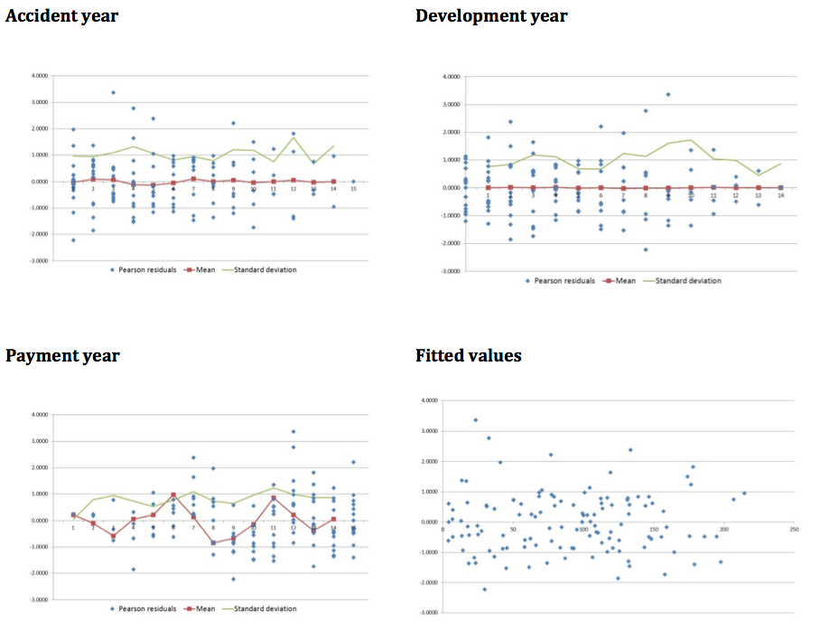

The same plots are now shown in the figure below for the second simulated data set. This data set has a calendar or payment year trend but has been modelled using an ODP so the payment year trend is not captured in this model.

#### Residual scatterplots for simulated data set 1
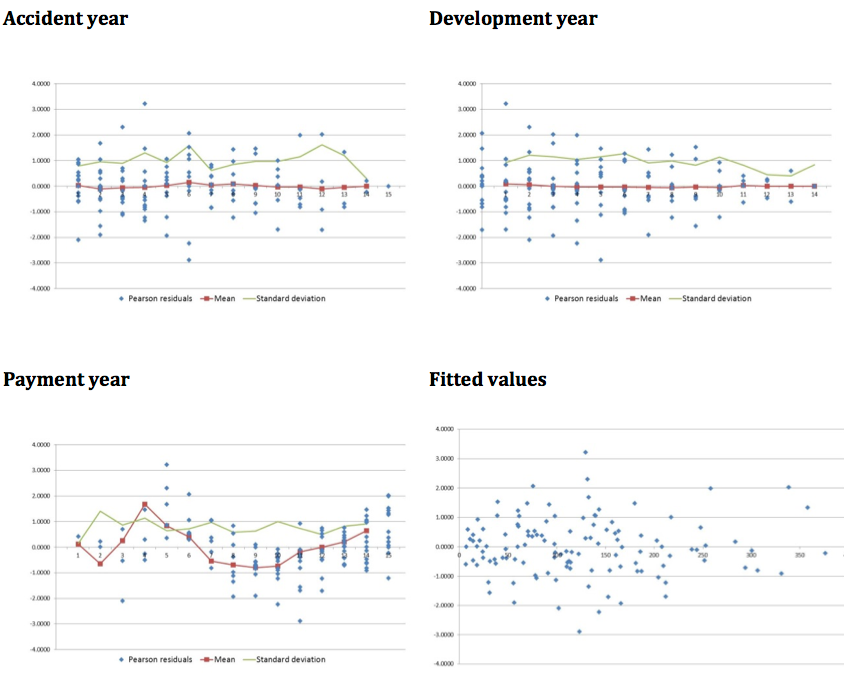

The payment year scatterplot clearly displays a trend in the residuals.

The plot of residuals against fitted value (or, depending on the scale, the log of the fitted value) is particularly useful to assess whether the variance assumptions are correct. Since the variance will often depend on the magnitude of the fitted value, a funnel pattern in the residuals by fitted value suggests that the variance assumptions are incorrect. For claims reserving problems, the magnitude of the payments will also be strongly correlated with development year, so scatterplots by development period may also be useful in testing variance assumptions.

### One-way Summary Plots of Actual and Fitted Values

Residual scatterplots are powerful tools, testing both model fit and the distributional assumptions globally and locally. However, while building a model, it may be helpful to consider the model fit in isolation through the comparison of summaries of actual and fitted values. This removes the distraction of the dispersion of residuals.

Figure [*Actual vs fitted graps by payment year*](#Actual vs fitted graps by payment year) plots, for each payment year:

- The sum of actual payments in that year
- The sum of expected payments in that year based on the fitted model
- Actual/fitted values on the secondary axis.

The comparison of actual and fitted values fluctuates around 100% for data set 1, which has been correctly modelled. However, data set 2 shows systematic differences between actual and fitted values providing evidence of a missing payment year trend.

The pattern of the actual/fitted series in Figure [Residual scatterplots for simulated data set 2](#Residual scatterplots for simulated data set 2) mirrors that of the mean series in Figure [Residual scatterplots for simulated data set 1](#Residual scatterplots for simulated data set 1) for the payment year scatterplot (bottom left hand graph) so some modellers may choose to rely on residual plots alone. Using actual vs fitted plots in addition to residual plots is a matter of personal preference. However, an advantage of the actual vs fitted plots is that they include the magnitude of the payments involved so the modeller can pay particular attention to the fit of the model where payment levels are high.

#### Actual vs fitted graps by payment year

##### Correct model fitted (data set 1)

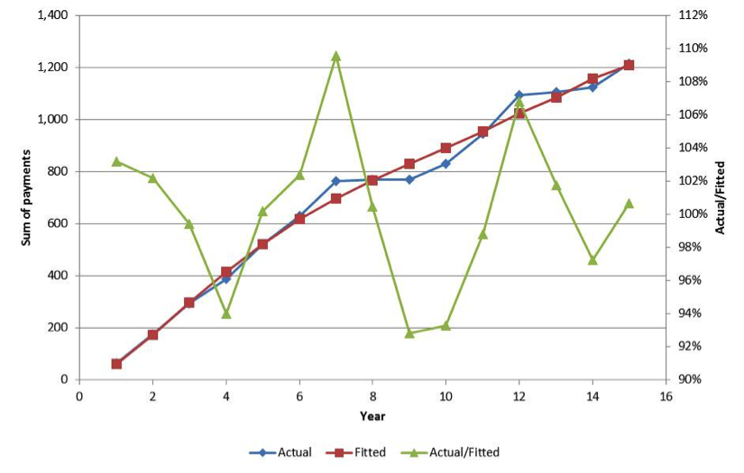

#### Unmodelled payment year trend (data set 2)

Note: The accident and development year graphs are not shown since all ratios are 100%. This is a direct consequence of fitting a model with parameters for all accident and development periods with an ODP distribution since the estimation process ensures that the marginal totals are equal. This is true for simulated data set 2, even though the model is inadequate.

### Heat Maps

For the claims reserving problem it is particularly useful to consider a triangular heat map of the actual/fitted values (or, equivalently, the standardised residuals) since this may assist in identifying areas of poor fit where there may be calendar period trends or interactions between accident and development periods.

Figure [Heat maps for data set 1 (correctly modelled)](#Heat maps for data set 1 (correctly modelled)) shows heat maps for actual/fitted values by accident and development year and by accident and payment year for data set 1 which has been correctly modelled. The actual/fitted percentages have been colour coded so that low values are blue, values around 100% are white and large values (i.e. where actual exceeds fitted) are red. In a well-fitting model we would expect a random scattering of colour with no discernible pattern and this is indeed the case.

#### Heat maps for data set 1 (correctly modelled)

##### Accident Development

##### Accident/payment year triangle

Figure [Heat maps for data set 2 (payment year trend not modelled)](#Heat maps for data set 2 (payment year trend not modelled)) presents the same heat maps for data set 2 where there is an unmodelled payment year trend. There are systematic patterns visible in both triangles – early and late payment years tend to have higher actual values greater than fitted values, while mid-term payment years tend to have higher fitted values.

For data set 2, we already know from the residual and one-way summary plots of actual vs fitted that there are unmodelled payment year trends so in this case the heat map may not add new information. However, heat maps are particularly useful at identifying interactions. For example, a payment pattern change impacting some accident years but not others would generate a systematic pattern in a heat map. Taylor and McGuire [[TM15](#TM15)] contains an example of using a heat map to identify and suitably model an interaction in an ODP model.

#### Heat maps for data set 2 (payment year trend not modelled)

##### Accident Development

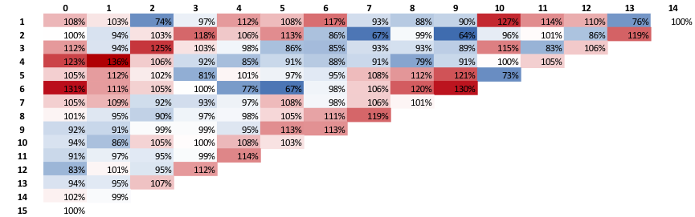

##### Accident/payment year triangle

## Model Specific Tests

### Mack Model Assumptions

Recall the three assumptions of the Mack model from section [Mack's Model](#Macks Model):

1. For each $j = 1, \dots , n-1$ there are development factors $f_j$ such that 
$E[C_{i, j+1} | C_{i1}, \dots , C_{ij}] = C_{ij} f_j;$

2. Origin periods are independent i.e. for each $s \neq t$ ,  
$\left\{C_{s1}, \dots, C_{sn}\right\}, \left\{C_{t1}, \dots, C_{tn}\right\},$ are independent.

3. For each $j = 1, \dots, n-1$ there are parameters $\sigma^2_j$  such that 
$Var[C_{i,j+1}|C_{i,1}, \dots , C_{ij}] = C_{ij} \sigma^2_j$.

When using the Mack model, each of these assumptions should be tested to ensure that they are appropriate for the data set in question.

#### Development Factors Test

[Ma97] shows that (1) implies that the sequential development factors $C_{ij}/C_{i.j-1}$ and  $C_{i,j+1}/C_{ij}$ are not correlated. He uses this fact to develop a test for whether the model should be applied, taking the following points into consideration:

- Development factors in adjacent development periods will generally not be identically distributed – they will usually have different means and different levels of variability. Therefore a non-parametric statistic such as the Spearman rank correlation should be used.
- On pragmatic grounds, isolated cases of correlations between successive development factors may not negate the use of the Mack model. However, widespread correlations in the data set are problematic. Thus, he develops a test over the entire data set. Note this is also desirable from statistical grounds – it is undesirable to compare every set of adjacent development factors since, even with no correlations present, some are likely to return significant values due to chance.

A brief overview of this test is given below; full details may be sourced from Appendix G in [[MA97](#MA97)].

- First take the development factors in development period $j$ and $j-1$ and remove any in $j$ that do not have a matching factor for that accident period in development period $j-1$ (and vice versa – remove any in $j-1$ that do not have a match in $j$).
- Rank the factors separately for $j$ and $j-1$.
- Calculate the Spearman correlation coefficient as $T_j=1-\frac{6}{(I-j)^3-I+j}\sum_{i=1}^{I-j}\left(r_{ij}-s_{ij}\right)^2$ where

- $I$ the number of accident periods ($=n$ in the specification of the [Mack model](#Macks Model) for a regular reserving triangle).
- $J$ the number of development periods ($=n$ in the specification of the [Mack model](#Macks Model) for a regular reserving triangle).
- $r_{ij}$ is the rank for the development factor in accident period $i$, development period $j$
- $s_{ij}$ is the rank for the development factor in accident period $i$, development period $j-1$

- Combine all the calculated coefficients into one statistic as $T=\sum_{j=2}^{I-2}\frac{I-j-1}{(I-2)(I-3)/2} T_j$
- It may be shown that $E[T]=0$ and $\mbox{Var}(T)= \frac{1}{(I-2)(I-3)/2}$ 
- Mack then proposes using a normal distribution at the 50% confidence level as a suitable test for the appropriateness of using the Mack model.

#### Independence of Accident Years

The main cause of correlations between accident years are calendar year effects which arise in data for many reasons (e.g. a court case setting a precedent for awarded damages, changes to the claims handling department affecting all claims from a particular point in time onwards etc.).

The graphical model diagnostics described above in section [Residual Diagonstics](#Residual Diagonstics) are likely to indicate if a calendar period trend is present and are straightforward to implement. Additionally for the Mack model, [Ma97] develops a test for the independence of accident years, as described in Appendix H to that paper.

The idea underpinning this test is that, in the presence of a non-constant calendar year trend, diagonals of development factors will tend to have either larger or smaller than usual development factors. Thus, Mack proposes carrying out the following procedure:

- For each development period $j$ (i.e. column of the data set), order the development factors and separate them into a set of small factors ("SF") and large factors ("LF") using the median of the development factors in that development period.
- For each diagonal, count the number of large and small factors.
- Under the null hypothesis of independent accident periods, development factors should be equally spread between small and large factors (subject to sampling variability). Therefore a binomial distribution with probability $p$ and $n=$ number of entries in the diagonal may be used to assess the significance of the number of large and small factors.

Refer to Appendix H of [[MA97](#MA97)] for full details.

#### Mack Sigma

The sigma (or alpha) squared variance parameters are derived from the data and are proportional to the prediction error for each origin period. The behaviour of these parameters can be investigated as a way of checking that the data satisfies the Chain Ladder assumptions. These parameters reduce to zero with increasing origin age – this makes intuitive sense as older origin periods are expected to have a more certain outcome, and the development factors themselves run off to one as we have no tail factor in the basic Chain Ladder model. Graphing the progression of these variance parameters against the development period should produce a shape akin to an exponential decay to zero:

- Kinks in this chart point to particularly large or small development factors (which will both produce large squared differences and thus large variance parameters). There may be some large losses; and
- In addition, large kinks in the chart may also point to data that doesn't quite satisfy the Chain Ladder assumptions (e.g. the origin years generally have the same underlying pattern).

The variance parameters operate multiplicatively – an interesting result of this is that the Mack prediction error from applying the Mack method to a quarterly triangle will be greater than that from an annual triangle. From a statistical point of view, we are estimating four times as many development factors (and thus four times as many parameters) for each origin period, and hence this contributes to a higher estimation variance.

### ODP Model<a name="ODP Model">

#### ODP Distribution

Strictly speaking, if using an ODP model, the ODP assumptions should be checked - i.e. is the ODP model a good representation of the data. One powerful way of validating the ODP distribution is to use a Probability-Probability ("P-P") plot. The description below of a P-P plot for stochastic reserving problems is taken from Taylor and McGuire [[TM15](#TM15)].

In general, a P-P plot is a graphical method for comparing two probability distributions, and plots two cumulative distribution functions ("cdf"s) against each other. Given an input, $u$, the plotted points are ($F(u), G(u)$) , where $F$ and $G$ represent the cdfs being compared. Thus, the range of the plot is the unit square $[0,1] \times [0,1]$. Each plotted point represented the probability of being $\leq u$ under the distributions $F$ and $G$ respectively.

In a GLM application, one distribution will correspond to the selected error distribution (e.g. ODP for the ODP model) and will be referred to as the "theoretical" distribution. The values of the theoretical distribution are calculated assuming the ODP assumptions are correct. The other distribution will correspond to the modelled data (the "empirical" distribution) and is simply an ordered series (by the theoretical probability) of the actual data. In effect, the empirical distribution points are simply $m$ equally spaced points in $[0,1]$ where $m$ is the total number of observations in the data set.

If the model fits well, the P-P plot should be an approximately straight line of the form $y=x$. Significant deviations from the straight line indicate problems with the distributional assumptions.

The next two figures show Poisson P-P plots for a correctly specified distribution (Figure [Plot with correctly specified distribution](#Plot with correctly specified distribution)) and an incorrectly specified one ([Plot with incorrectly specified distribution](#Plot with incorrectly specified distribution)). The distribution in Figure [Plot with incorrectly specified distribution](#Plot with incorrectly specified distribution) is heavier tailed than a Poisson distribution (in this situation, a Tweedie distribution might be useful). More details on P-P plots may be found in the statistical literature.

#### Plot with correctly specified distribution

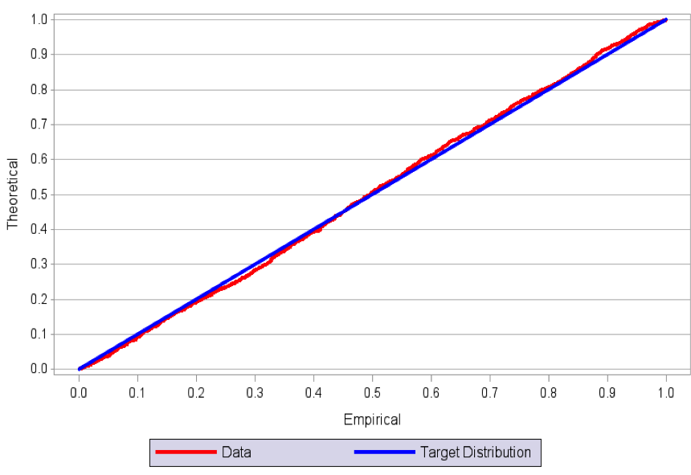

#### Plot with incorrectly specified distribution

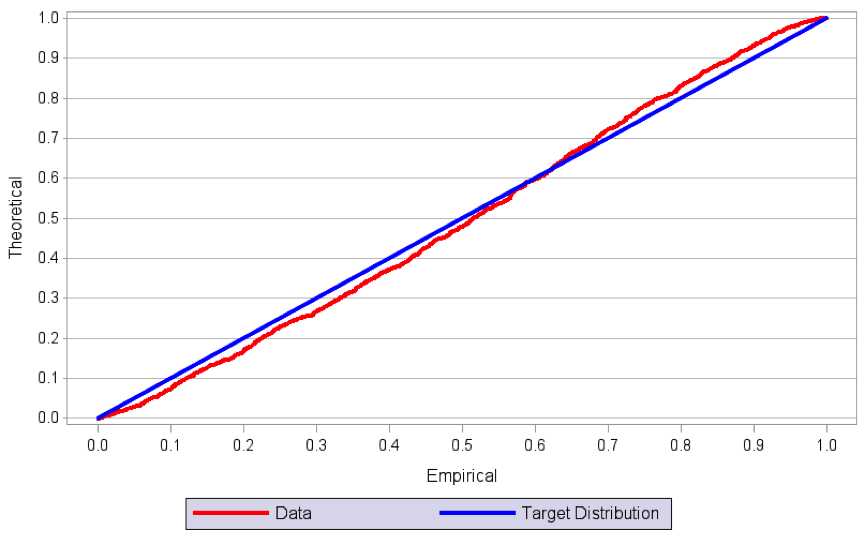

#### ODP Dispersion Parameter

In the definition of the ODP model given previously, the same value of the scale parameter is used throughout the triangle. However, it is possible and sometimes desirable to use a separate scale parameter for each development period. This is worth considering if residuals appear to be much more spread out at some development periods than others, which indicates a breakdown in the assumption that the scale parameter is constant throughout the triangle (such residuals are said to be heteroscedastic as discussed in section [Residual Scatterplot](#Residual Scatterplot)). Scale parameters that have been allowed to vary in this way are often lower for the first few development periods while expected incremental claims are large, reach a peak as incremental claims level off but there is still some volatility, and then decrease again at old ages where the volatility drops off.

[Residual scatter plots](#Residual Scatterplot) are helpful to test for the constancy of the scale parameter. Scatter plots by development period and also by the fitted value (or log of the fitted value) should be carefully examined. Any systematic pattern in the variability, but not the mean) of these residuals may indicate that a constant scale parameter is not acceptable (or that the selected weights for varying the scale parameter are inadequate). For example, if the variance by development period increases at a faster rate than the mean, then the residuals will exhibit a funnel pattern, with a larger spread for higher development periods.

### Burnhuetter-Ferguson Model

There are no specific additional diagnostics plots for the BF with underlying ODP model as presented in this paper. In general this model is used for lines of business which are long-tailed or volatile or both. The actuary should have due consideration for whether the results from the BF model are reasonable. It may be helpful to refer to industry data if available.

## What to Do if Validation Fails

If a model fails any of the above tests, then the modeller should consider revising the model to improve the fit. The particular action taken depends on the way in which the validation fails. A number of examples are given below.

**Outliers in residual plots**

Firstly, have the residual plots identified any outliers. If there are outliers, should they be removed? Or if outliers have been removed, should they be put back in? Are there any other oddities in the data that should be investigated further? Refer back to section [Treatment of Outliers](#Treatment of Outliers) for some further discussion.

**Distributional assumptions**

If the goodness of fit appears satisfactory (e.g. actual vs expected looks good, no particular bias in the mean of the residuals) but the residuals exhibit heteroscedascity (e.g. the residuals have a fanning pattern by development period) or the P-P plot deviates materially from a straight line then some revision to the distributional assumptions should be considered.

A varying scale parameter by development period may solve the problem. Alternatively, if fitting a model using GLM software, the modeller could consider using a different distribution. For example, if fitting an ODP with no constant scale parameter, then the ODP assumption implies that the variance of an observation is proportional to its mean. If a Gamma distribution were used instead, then the standard deviation would be proportional to the square of the mean. A heavier tailed distribution like the Gamma (or other Tweedie member with p>1) may often be more appropriate for insurance data.

**Goodness of fit**

If a deficiency is detected in the goodness of fit diagnostics (e.g. in the heat map, or residuals or actual vs expected), then the modeller needs to address this area of poor fit. The action taken depends on the source of the different experience. For example, if a small portion of the triangle has unusual experience that is believed to derive from something temporary (e.g. a slowdown in claim finalisations for a few months due to a systems change), then this experience may be excluded from the model.

However, if the change is expected to be permanent, then it should be explicitly modelled. For example, if, in the most recent years, court awards for some injuries have increased, then, if fitting a Mack Chain Ladder model, it may be necessary to only use the most recent experience when estimating development factors for use in projection.

If adjustments are necessary to ensure a well-fitting model then it is important to exercise due care in the application of any bootstrapping procedure. As discussed in section [Estimating Reserve Distribution](#Estimating Reserve Distribution), proper use of the bootstrap requires i.i.d residuals. Consider a 10 year triangle with changed experience in the most recent 3 years so that future development factors are estimated using only the most recent 3 years of data. A simple application of the bootstrap where development factors are estimated on all data would fail the Chain Ladder tests above and would lead to poorly fitting residuals and therefore, an unreliable estimate of variability. So too would applying the estimated development factors to data more than three years old. In this case, two sets of development factors are required: one set for years 1 to 7 and the second set for years 8 to 10. The modeller would then need to check that variability levels are similar between the older data and the newer data before running a bootstrapping procedure.

Finally, if the adjustments above do not lead to an acceptable model, it may be necessary to consider alternative models and approaches such as those discussed in section [Other Models](#Other Models).

# Estimating the Reserve Distribution

In section [Model Validation](#Model Validation), we referred to analytical formulae for calculating MSEP for the Mack and stochastic BF models. In this section we discuss the estimation of parameter and process error using bootstrapping and Monte Carlo simulation. We open by discussing each of these in general terms which may, in principle, be applied to any reserving model. We conclude the section by discussing the implementation of these procedures for the three models under consideration in this paper.

## Parameter Error - Bootstrapping

As we have seen in section [Sources of Uncertainty](#Sources of Uncertainty), the parameter error is the error due to the fact that the parameters of the fitted model are estimated and are thus uncertain. Ideally, in order to estimate this uncertainty, we need other samples from the same population, which are often (always, in the reserving case) not available. In order to overcome this issue, a common approach used in statistics is the bootstrapping technique (Efron [[Ef79](#Ef79)]), which creates pseudo samples (or data sets) from the original data using re-sampling. The re-fitted model for each of these data sets effectively results in many different parameter estimates, thereby allowing the estimation of parameter uncertainty.

We describe two bootstrapping techniques here::

- **Semi-parametric bootstrap:** also known as re-sampling, where i.i.d. variables are re-sampled to obtain an approximation of the underlying distribution. This is the most commonly used form of bootstrap in stochastic reserving.
- **Parametric bootstrap:** when the distribution is known, i.e. a parametric model is fitted to the data and samples of the parameters are directly drawn from this model.

A re-sampling approach suitable for use with aggregate data triangles was described by Efron [[Ef79](#Ef79)] in his discussion of bootstrapping for a regression model. When using re-sampling, it is important to ensure that the variables that are re-sampled are independent and identically distributed (i.i.d.). Data points in a claim triangle will almost certainly not be i.i.d., so these amounts must first be transformed to meet this requirement. The common practice for stochastic reserving is to calculate residuals for the model which, after standardisation, should be i.i.d. These residuals are then sampled (usually with replacement), with one standardised residual attaching to each past cell. The residuals are then unstandardised (ie multiplied by the estimated variance of the residuals in that cell, which would normally be estimated by development period) and added back to the fitted values in each cell to produce pseudo triangle data from which parameters may be estimated by refitting the model.

Parametric bootstrapping is useful in cases where a full statistical model has been fitted such as a GLM. One possible method for parametric bootstrapping is to recognise that under certain conditions usually satisfied by a GLM, the resulting parameter estimates are asymptotically multivariate normal. Therefore, pseudo parameter values may be directly sampled from this distribution, producing a new set of parameters for each bootstrap iteration, from which fitted and projected values may be calculated. This procedure is computationally much less demanding than the semi-parametric bootstrap and worth considering if a formal GLM structure has been used for the stochastic reserving exercise. This approach is discussed by Taylor and McGuire [[TM15](#TM15)] and readers are referred there for further details.

A typical **bootstrap cycle** operates in the following manner:

- Generate a pseudo dataset using a parametric/semi-parametric bootstrap
  - For the semi-parametric bootstrap, the residuals are re-sampled and then combined with the fitted values to form a pseudo data set. The model is then fitted to produce a set of pseudo parameters.
  - For the parametric bootstrap, a sample of model parameters is drawn from a multivariate normal distribution, producing a set of pseudo parameters.
- Forecast the reserve using the pseudo parameters.
- Start a new cycle.

The variance of the resulting reserves from each sampled data set provides an estimate of the parameter error in the reserves.

## Process Error

There are two common approaches to estimating process error (ie the error related to the uncertainty of the process itself) following a bootstrap procedure – residual re-sampling and Monte Carlo simulation.

### Residual Resampling

Process error may be incorporated by a further re-sampling of the standardised residuals, in a manner identical to that of the semi-parametric bootstrap, except that the residuals (after being multiplied via the assumed standard deviation) are added to the future forecast values of the data triangle rather than to past values.

This version of the bootstrap is described in many places in the literature, e.g. Taylor [[Ta00](#Ta00)]. One of its strengths is that it does not require the exact form of the distribution to be specified. For this reason, the semi-parametric bootstrap combined with residual re-sampling for process error estimation is usually called **non-parametric bootstrapping**. It is useful in situations where a parametric distribution such as an ODP may not be a particularly good fit to the data and is frequently used in practice.

### Monte Carlo Simulation

An alternative to using residual re-sampling to estimate process error is to sample directly from the distribution of the forecast value (refer back to Figure [Process Error](#Process Error)). This requires the following assumptions:

- The distributional form of the forecast value
- The parameters of this distribution – usually, specification of the mean and variance is sufficient to determine these.

This is actually Monto Carlo simulation – a procedure used to find the distribution of an unknown (i.e. not derivable analytically, or difficult to derive) probabilistic quantity function of simpler - and so suitable to be simulated - random variables. Due to the number of simulations involved, Monte Carlo methods are usually computationally intensive, but improvements in processing power in recent years have mitigated this disadvantage and made these methods increasingly popular.

There are two main advantages of using a Monte Carlo method instead of an analytical formula:

- It is usually simpler to implement (analytical formulas can be complex or even impossible to derive); and
- It returns as output the full distribution, whereas analytical formulas usually only give the first two moments.

The main disadvantage of these methods, as noted above, is the computationally intensive nature of the method, but this has been largely mitigated by increased processing power over recent years.

The Monte Carlo method is fairly simple to implement for stochastic reserving.

In general, a simulation cycle (i.e. to obtain one reserve simulation) proceeds as follows:

- Generate a simulated value for every random variable in the process (e.g. every projected future cell in a data triangle);
- Derive a reserve from the simulated values given above (e.g. sum over all simulated values of future cells); and
- Start a new cycle.

The resulting volatility from all the simulated reserves from this simulation cycle yields an estimate of the process error.

## Simulation Cycle - Parameter and Process Error

The processes described in section [Estimating the Reserve Uncertainty](#Estimating the Reserve Uncertainty) may be combined to produce a simulation cycle for stochastic reserving yielding estimates of reserves that include both parameter and process error. In order to do this, the bootstrap cycle is embedded into the simulation cycle, giving a general stochastic reserving **simulation cycle** , as follows:

1. If using a semi-parametric bootstrap, generate a pseudo dataset by re-sampling residuals and combining with fitted values to form a pseudo data set.
2. Inclusion of parameter error:
  1. Semi-parametric bootstrap: Fit the model to find the parameter estimates.
  2. Parametric bootstrap: the simulation cycle starts at this step – generate a sample of the parameters from a multivariate normal distribution based on the mean and covariances of these parameters that are produced by a GLM
3. Generate the unknown future part of the triangle from the parameter estimates derived at the previous step;
4. Inclusion of process error: use either residual re-sampling or simulation as appropriate.
  1. Residual re-sampling: re-sample the model residuals and combine with the forecast values.
  2. Simulation: Simulate each cell of the future part of the triangle to incorporate process error
5. Derive the total reserves from the generated data;
6. Start another cycle.

The reserves from each simulation cycle form a distribution which includes both **parameter** and **process** errors.

This process underlies the estimation of the ultimate view of reserve risk for each of the models discussed in this paper, as will be seen in the next section.

## Ultimate View Simulation<a name="Ultimate View Simulation">

We now discuss the specifics of the estimation of the ultimate view of reserve risk for each of the three models considered in this paper. The main reference for this is England and Verrall [[EV02](#EV02)], which considers a variety of different methods.

### Mack

As discussed in England and Verrall [[EV02](#EV02)], the assumptions (and results) of the Mack model are very similar to the normal approximation of the negative binomial model. The assumptions are as follows:
- The over-dispersed negative binomial model assumes that the incremental payments $P_{ij}$ have the following distribution: $P_{ij} \sim \mbox{ODNB}\left(\mu=\left(\lambda_{j-1}\right) C_{i,j-1},\sigma^2=\phi \lambda_j \left(\lambda_j - 1 \right) C_{i,j-1}\right)$, where $\lambda_j$ is equivalent to the standard volume all Chain Ladder factor $f_j$ from development year $j-1$ to $j$. Additionally, there is an unknown dispersion parameter $\phi$ forming part of the variance, which makes the distribution "over-dispersed";
- Noting that $C_{ij}=C_{i,j-1} + P_{i,j}$, and assuming that in this (recursive) approach $C_{i,j-1}$ is known, we can rewrite the above as: $C_{ij} \sim \mbox{ODNB}\left(\mu= f_j \, C_{i, j-1}, \sigma^2=\phi \, \lambda_j \, f_j \left(f_{j-1} - 1 \right) C_{i,j-1}\right)$.

However, the ODNB assumption is not generally used in practice. As proven by Mack and Verrall [[MV00b](#MV00b)], since the negative binomial model is derived from the Poisson model, the predictive distributions are essentially the same and give identical predicted values. Furthermore, if $f_j < 1$ the variance of the model above is negative and the ODNB model breaks down. To overcome this, we require a distribution whose support is not restricted to the positive real domain. The Normal distribution is a suitable candidate. Therefore, we can replace the ODNB assumption with a Normal approximation, retaining the same mean and variance, as much as is possible for the variance, i.e. we would expect the variance to be proportional to $C_{i, j-1}$ with a constant of proportionality depending on $j$.

Thus the Normal approximation is given below:
$$
C_{i,j} \sim \mathcal{N} \left(\mu=f_j \, C_{i,j-1},\sigma^2=\phi_j \, C_{i,j-1} \right)
$$

Comparing this formula to Mack's assumptions:

$$
E[C_{i,j} |C_{i,j-1} ]=f_j \, C_{i,j-1},
$$
$$
\mbox{Var}[C_{i,j} |C_{i,j-1} ] = \sigma_j^2 \, C_{i,j-1},
$$

we observe that they are very similar (apart the Normal distribution assumption): the unknown scale parameters $\phi_j$ are simply replace by the $\sigma_j^2$ of the Mack model. In fact, their parameter estimates are essentially the same (see section 7.6 of [[EV02](#EV02)]), fitting a properly parametrised GLM model on the development factors (see section 7.4 of [[EV02](#EV02)]) and considering similar bias corrections.

Summarising all the results above, a simulation cycle for the Mack method is comprised of the following steps:

1. Store the observed cumulative triangle $C_{ij}$ as weights $\omega_{ij}$;
2. Fit Mack analytical model to derive the model parameters $(f_j, \sigma_j^2)^{Mack}$ for $0 < j \leq n$;
3. Using either a parametric or a semi-parametric bootstrap on the known triangle, generate a set of pseudo development factors $F_{ij}^B$ from the parameters estimated at the previous step;
4. Derive the bootstrapped model parameters $(f_j^B, \sigma_j^2 = \phi_J^B)$ from the pseudo development factors $F_{ij}^B$ using $\omega_{ij}$ as weights;
5. Using the above bootstrapped parameters, derive the cumulative payments for the future triangle, adding the process error via generating a random number from the Normal distribution: $C_{i,j} \sim \mathcal{N} \left(\mu=f_j^B \, C_{i,j-1},\sigma^2=\phi_j^B \, C_{i,j-1} \right)$ . Alternatively process error may be incorporated by a further re-sampling of residuals;
6. Once the future cumulative claims have been derived, derive both the reserve $R^s_j$ for the origin year $i$ and the total reserve $R^s_{TOT}$ simulation cycle $s$.

Given a sufficient number of simulations, we may use the mean and variance of the simulated reserves to estimate the overall uncertainty. Note that the latter will include both parameter and process error due to respectively step 3 and 5.

### Over-dispersed Poisson

The ODP is a somewhat simpler model than Mack, since - as we have seen in [earlier](#Over-dispersed Poisson Model) - a GLM can be directly parametrised on the incremental claims, which are assumed to be:
$$
P_{ij} \sim \mbox{ODP}\left(\mu=m_{ij}, \sigma^2= \phi \,m_{ij} \right), 
$$
where - as we have previously seen $\log(m_{ij}) =\eta_{ij} = \alpha_i + \beta_j$ , i.e. the expected incremental payment is a function of both the origin period and the development period factors.

For the ODP model, a simulation cycle is as follows:

1. Fit a GLM  as specified in the section [Over-dispersed Poisson Model](#Over-dispersed Poisson Model) on the $P_{ij}$ 	to derive the estimate $(\alpha_1, \dots,\alpha_n, \beta_1, \dots, \beta_n, \phi)$ of the GLM parameters;
2. Parameter error:
    + If using a semi-parametric bootstrap then generate a set of pseudo incremental payments $P_{ij}^{k,B}$ and Fit another GLM on the pseudo payments $P_{ij}^{k,B}$, to derive a bootstrapped estimate $(\alpha_1^B,\dots,\alpha_n^B,\beta_1^B,\dots,\beta_n^B,\phi^B)$ of the GLM parameters;
    + If using a parametric bootstrap, sample the GLM parameters directly to obtain the bootstrapped estimate of the parameters.
3. Using the bootstrapped parameters above, derive the future triangle payments introducing the process error by either:
    + generating a random number from the ODP distribution : $P_{ij}^{u,B} \sim \mbox{ODP}\left(\mu=m_{ij}^B, \sigma^2= \phi^B \, m_{i,j}^B \right)$; or
    + Re-sample the residuals and apply to the forecast payments
4. Once the future unknown payments have been simulated, derive both the reserve $R_i^s$ for each origin year $i$  and the total reserve $R_{TOT}^s$ for the simulation cycle $s$.

As for the Mack case, the mean and variance of the resulting distribution of simulated reserves estimate the best estimate and reserve uncertainty.

### Stochastic Burnhuetter-Ferguson

The process of simulating the stochastic BF model of Alai, Merz, and Wüthrich has not been covered in the literature. The following is therefore our own preliminary thoughts on how this could be done. We have included these suggestions in this paper to act as a springboard to future discussion on the appropriate use of the stochastic BF. The use of numerical bootstrapping and simulation methods for the stochastic BF and for the estimation of the one year reserve risk in particular is a subject of ongoing work for the working party.

As described in section 4.3, Alai, Merz and Wüthrich's stochastic BF model is based on the ODP model. The first few steps for simulating from this stochastic BF model will therefore be the same as the first few steps for simulating from the ODP model (as described in section [Monte Carlo Simulation](#Monte Carlo Simulation)).

In addition, we need the following two items (as seen in section [A Stochastic Burnhuetter-Ferguson Model](#A Stochastic Burnhuetter-Ferguson Model)):

1. The *a priori* estimates of the ultimate claims  $U_i$ for each accident year $i$; and
2. The *a priori* estimates of the standard deviations of the prior estimates of the ultimate claims for each accident year $i$.

The estimates of the ultimate claims are usually readily available (as they would have been used in the deterministic BF calculations and so would be available from the pricing or reserving departments). However estimating their standard deviation is considerably more difficult. One possible simplifying assumption is to fix a single CoV  for all origin years and to calculate the standard deviations accordingly (by multiplying the CoV by the a priori estimate of ultimate claims). It would be natural to estimate this CoV using expert knowledge or looking at the uncertainty of the historical ULR per accident year. 

A simulation cycle for Alai, Merz and Wüthrich's stochastic BF model might proceed as follows:

1. Simulate parameter error exactly as for the ODP, described above in steps 1 and 2 of section [Over-dispersed Poisson](#Over-dispersed Poisson). From the simulated parameters calculate the pseudo incremental development pattern.
2. For every origin year $i$, simulate  a random a priori ultimate, with mean $U_i$ and standard deviation given by $CoV \cdot U_i$;.
3. Simulate the future incremental paid amounts in exactly the same way as for the ODP model, except that the mean and variance will be calculated using the pseudo incremental development pattern and the simulated prior estimate of the ultimate claims, and so will be  given by the formulae $E[P_{ij}]= y_i \, \nu_i$ and $\mbox{Var}[P_{ij}] = \phi \, y_i \, \nu_i$ where $y_i$ is the pseudo incremental  development proportion  simulated in step 1 above, and $\nu_i$ is the a priori ultimate simulated in step 2 above.
4. The simulated reserve for each origin period is then just the sum of the future incremental claims payments, and the BF ultimate claims and the simulated reserve plus the latest simulated cumulative claims amount. The total reserve is then the sum of the reserves for each origin year $i$.

As for the previous models, the mean and variance of the resulting distribution of simulated reserves give the best estimate reserve and the uncertainty of the best estimate.

### Reserves at High Probabilities of Adequacy

It is important to add a cautionary note for any users who intend to use any method for estimating reserves at high levels of adequacy (typically over 90%). Bootstrapping results (or indeed, a log normal distribution or similar for cases where model validation fails) become less reliable for the more extreme percentiles. In bootstrapping, this may be partially mitigated by running a large number of bootstraps – confidence in results from 1,000 or 10,000 bootstraps is far greater than that from 100. However, even with a large number of bootstrap simulations, caution must be exercised in determining high probabilities of adequacy as the chances of external events impacting the reserves is far greater when considering a 99% probability of adequacy versus a 75% probability. Therefore, we would recommend that due consideration be given to model error (section [#Sources of Uncertainty](Sources of Uncertainty)).

## Numerical Examples

We now apply the methods discussed in this paper to some real-life data sets to help illustrate their use in practice. It is worth noting, however, that the working party currently has a work stream to implement these and other examples in R, which will, once complete, considerably extend the detail on these numerical examples.

###	Example 1

The first dataset is taken from [[AMW09](#AMW09)] and [[AMW10](#AMW10)]. This is a reasonably well-behaved claims triangle, with a relatively short tail, and no unusual features immediately apparent. The data is presented below in Table 7 1 as a triangle of incremental claim amounts.

#### Example Data Set 1

Notes:
(1)	accident (or origin) years were labelled as 0,1,2,… in the original paper. 
(2)	All values in this and subsequent tables are in ‘000s

###	Analysis

Given the nature of the data, the Mack or ODP models are a reasonable starting point. The central estimates for both models may be calculated by applying the chain ladder algorithm. The resulting forecast incremental payments, ultimate amounts per year and reserves are shown in Table 7 2 and Table 7 3.

#### Chain-ladder payment projections for example data set 1<a name="Chain-ladder payment projections for example data set 1">

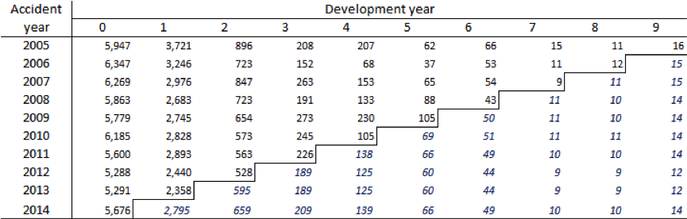

#### Chain-ladder reserve estimates for example data set 1<a name="Chain-ladder reserve estimates for example data set 1">

Before doing any further analysis, it is important to first validate the model.

#### Log(Mack $\sigma^2$) Parameters

For the Mack model the three specific Mack tests are carried out: the development factors correlation test, the independence of accident years and a plot of the $\sigma^2$ parameters (section [Mack Model Assumptions](#Mack Model Assumptions)). The first two tests are implemented in the spreadsheet attached to this paper (Stochastic Reserving Tool v1.3\_DATASET1.xlsb; refer to the "Executive Summary" tab for the results of these tests). According to these tests, the independence of accident years is satisfied (i.e. there are no apparent calendar year trends) but the development factors fail the correlation test. The $\sigma^2$ parameters may be calculated according to the formula in section [Analytic Calculation of MSEP](#Analytic Calculation of MSEP) and the logs of these values are plotted in the figure [above](#Log Mack sigma2 Param) above. Exponential decay translates to linear decay of the log values. There is a slight kink in the $\sigma^2$ values at development year 4 which may indicate problems with the assumptions.

On the basis of these tests, there may be some question marks over the applicability of the Mack model and it is worthwhile exploring alternatives.

#### ODP diagnostic plots

While the ODP model has the same central estimates as the Mack, its distributional estimates are different. The residual scatter plots, actual/expected plots (calendar year only) and heat maps are shown in Figure [ODP diagnostic plots](#ODP diagnostic plots) and Figure [Actual/fitted heat maps for data set 1](#Actual/fitted heat maps for data set 1). The residuals (standardised Pearson residuals) are calculated by fitting the ODP model as a GLM – this may be done in statistical packages such as R or SAS.

Although not perfect, the residual scatter plots do not reveal any serious problems with the model. There may be a suggestion of a trend in early calendar years, but data is limited here so the apparent trend is not of huge concern. The actual/fitted heat maps also appear acceptable.

#### Actual/fitted heat maps for data set 1<a name="Actual/fitted heat maps for data set 1">

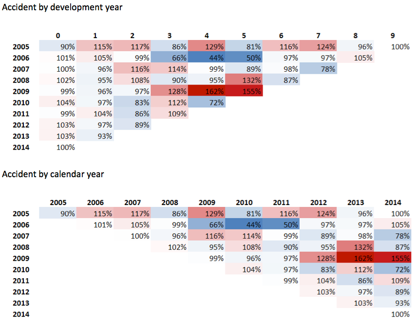

#### P-P plot for the ODP model

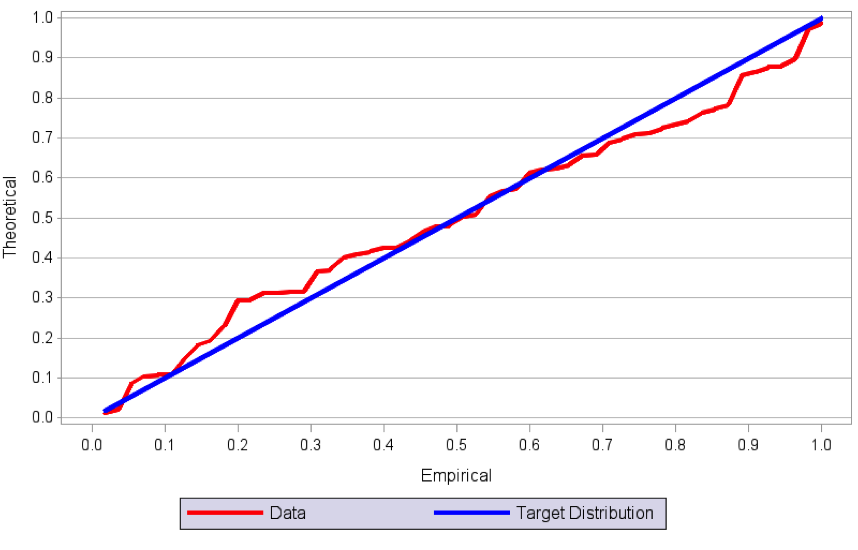

Finally, the P-P (probability-probability) plot for the ODP distribution is shown in Figure [P-P plot for the ODP model](#P-P plot for the ODP model). This graph is more coarse those that shown in Figure [Correct model fitted (data set 1)](#Correct model fitted (data set 1)) and Figure [Plot with incorrectly specified distribution](#Plot with incorrectly specified distribution) due to smaller amounts of data. It does suggest that the actual data distribution is not quite as heavy-tailed as an ODP distribution. However, given the small amounts of data, and the market practice view to generally stay on the side of conservatism, the ODP distribution may be accepted on pragmatic grounds.

On the basis of the above model diagnostics, the ODP model seems preferable to Mack. As this is a short-tailed data set with reasonably stable behaviour at early development years, use of the BF method does not seem warranted, at least not initially.

The next stage is to bootstrap the ODP model to estimate parameter and process error. This may be implemented using custom-built actuarial software or in statistical packages. As discussed in section [Estimating the Reserve Distribution](#Estimating the Reserve Distribution), there are a number of ways of doing this – parametric, semi-parametric or non-parametric bootstrapping may all be used. Here we have used a semi-parametric bootstrap, overlaid with Monte Carlo simulation of process error, run using the chain ladder package in R. The results are shown in the table below while figure underneath presents some of the information graphically.

#### Bootstrapping results for the ODP model (in thousands)

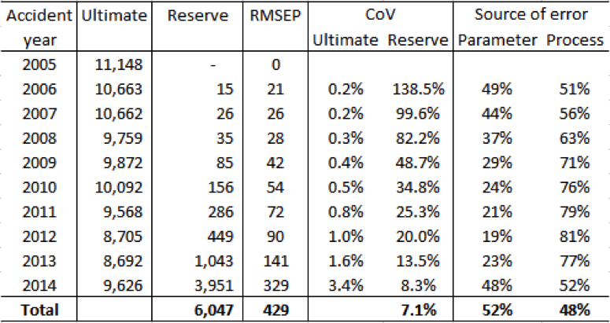

Notes:

1. Ultimate CoV is defined as MSEP½ /Ultimate. Reserve CoV is defined as $\sqrt{\mbox{MSEP}}/\mbox{Reserve}$
2. The table shows the breakdown of MSEP into parameter and process error

#### Sources of error for the ODP bootsrapping results

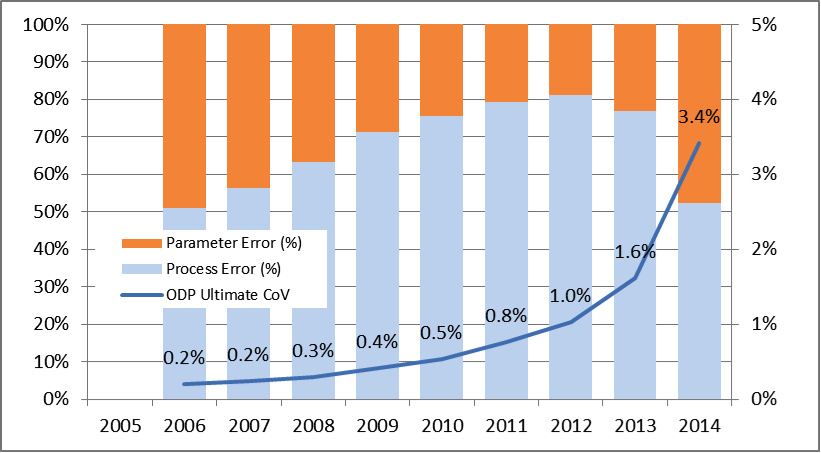

In the above table and graphs the following can be seen:

-	The MSEP decreases as accident (origin) periods get older. Consequently, the related quantities (the two CoVs, parameter error and process error) also decrease.
- The process error contributes a larger proportion to the total error in the middle-aged origin periods (peaking for origin period 2012), and a smaller proportion to the older and most recent origin periods.
- The parameter and process errors make significant contributions for all accident periods, though the weighting between them varies.
- The progression of the CoVs (both ultimate and reserve) is relatively smooth, with reasonable looking values for the most recent accident year. This supports the belief that a method like the BF is not required for this data set. Contrast this to the behaviour of the CoVs for example data set 2 below.
- Overall, the ODP bootstrap suggests a reserve CoV of 7.1%.

Of course, the bootstrap returns more than just the MSEP and CoV – it returns a full distribution including parameter and process error – see Figure 7 6 for an example of such output.

#### Distribution of the Outstandind Claims Reserves

### Comparison with Mack Results

The model validation section raised some question marks over the use of the Mack model for this data set. However, for illustrative purposes, it may be interesting to compare the ODP and Mack model analytic results. While both models give the same central estimate, they are different models, built on a different set of assumptions. Therefore we would expect the Mack results to reflect this, returning different variability estimates.

#### Analytic results for Mack's model

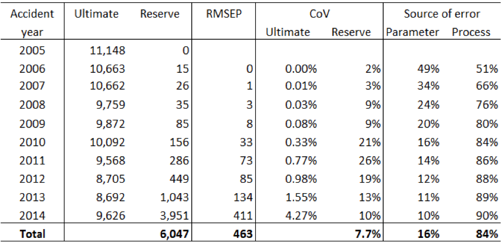

#### Comparison of reserve CoV

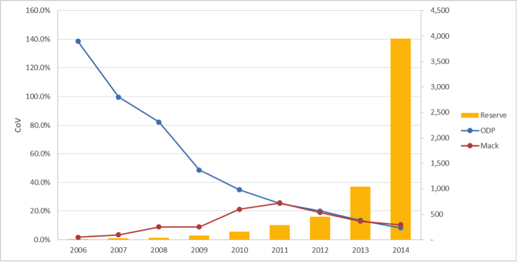

Table [Analytic results for Mack's model](#Analytic results for Mack's model) presents the analytic results for Mack's model while Figure [Comparison of reserve CoV](#Comparison of reserve CoV) compares the reserve CoVs by accident (origin) year. For older accident years, the MSEP is much larger for the ODP model than it is for Mack, however this fact is immaterial, as the underlying reserve is very small; this is clearly illustrated in Figure [Comparison of reserve CoV](#Comparison of reserve CoV). In more recent years, the MSEPs are similar or even higher (the most recent year). The relative contributions of parameter and process error are quite different similar between the two models, with process error being the dominant source of error. Overall Mack model suggests slightly higher uncertainty results, ending up with a 7.7% total CoV vs ODP's 7.1% and the models look fairly aligned as soon as reserves start to be material.

### An Alternative View – the BF Model

[[AMW09](#AMW09)] also includes prior estimates of the ultimate claims cost per year as well as assumed CoVs (5% for all years). It may be helpful to consider the estimates that result from the BF model as an alternative view of the outstanding claims liability.

#### BF reserve estimates for data set 1

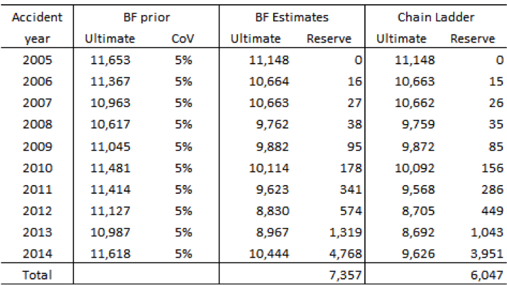

The reserve estimates are shown in Figure [Distribution of the Outstandind Claims Reserves](#Distribution of the Outstandind Claims Reserves). The results for all accident years are higher than the chain ladder estimates and overall, the reserve estimate is 22% higher. 
Table [BF reserve estimates for data set 1](#BF reserve estimates for data set 1) shows the results of applying the analytic formulae from [[AWM10](#AWM10)] for the stochastic BF while Figure [Comparison of BF and ODP RMSEP](#Comparison of BF and ODP RMSEP) compares the RMSEP from both methods.

#### Analytic results for the BF model

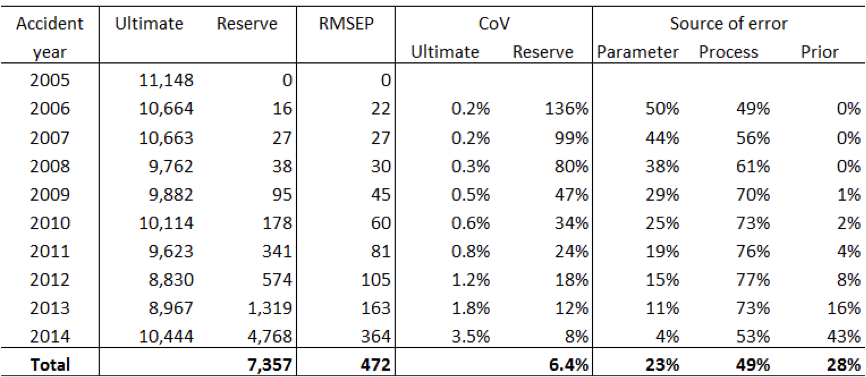

#### Comparison of BF and ODP RMSEP

The root MSEP is similar between both methods, though the BF does return somewhat higher estimates for more recent accident years. However, these are coupled with somewhat higher reserve estimates, so that the reserve CoVs are generally lower for the BF model. In total the reserve CoV for BF is 6.4% compared with 7.1% for the ODP model. This reflects the influence of the prior assumptions with their relatively low (5%) CoV.

The choice of which model (BF or ODP) to use for stochastic reserving purposes depends on the actuary's judgement as to which is the most appropriate. If one model is closer to that used to determine the central estimate, then this model would likely be the preferred choice for uncertainty estimation.
Once the process and parameter error have been determined, the actuary then needs to consider whether explicit allowance should be made for model error (section [Sources of Uncertainty](#Sources of Uncertainty)). If such allowance is made then the model error variability would normally be combined with that from the parameter and process error and a judgementally selected distribution (e.g. a log normal) to produce a distribution of outstanding claims. If no allowance is required for model error, then the distribution that results from the process and parameter error may be used directly.

## Example 2

The second illustrative data set is taken from Table 6 of [[LV08](#LV08)] and is an aggregate data set from Lloyd's syndicates. In [[LV08](#LV08)] Table 6 presents the paid data, and Table 7 the corresponding incurred data. This claims triangle is much more volatile than the first, and clearly has a long-tail. Consequently, it makes an interesting contrast to the first data set and is the type of business for which one might consider the Bornhuetter-Ferguson method.  The data are shown in Table 7 8 as incremental claim amounts.

#### Example data set 2

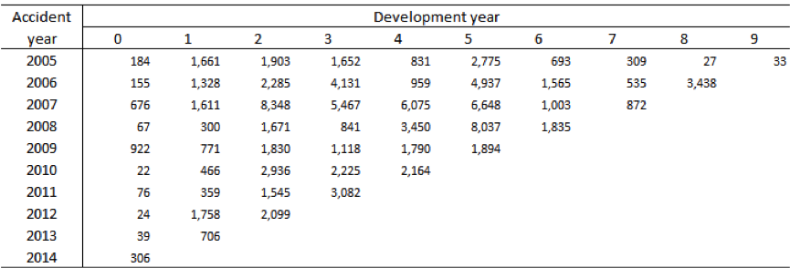

Note: accident (or origin) years have been re-labelled as 2005, 2006,....

### Analysis

We first consider the use of the Mack and ODP models for this data, though we might expect that the long-tailed nature of this class might mean that these models are unsuitable for use. The forecast incremental payments for both these models, ultimate amounts per year and reserves are shown in Table 7 -9 and Table 7 -10.

#### Chain-ladder payment projections for example data set 2

#### Chain-ladder reserve estimates for example data set 2

#### Log(Mack $\sigma^2$) parameters

The Mack model passes both the development factors correlation test and the independence of accident years (refer to the tab "Executive Summary" in the spreadsheet attached to this paper, Stochastic Reserving Tool v1.3\_DATASET2.xlsb). However the plot of the log of the $\sigma^2$ values does raise some concerns given that the progression is very much non-linear.

Residual scatter plots and actual vs expected by calendar year for the ODP model are shown in Figure 7 -24.

#### ODP diagnostic plots

The calendar year plot causes some concern as it appears that there may be a missing calendar year trend. A heat map of actual/fitted by accident and development year (Figure 7 -25) suggests there may be a missing interaction – development year 0 has been consistently low for 2010 to 2013.

### Actual fitted heat maps for data set 2

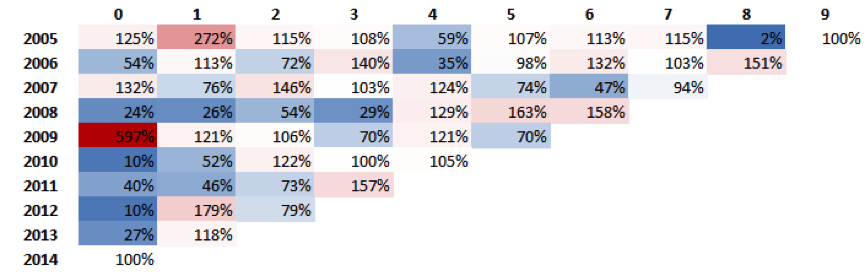

Consequently, doubts are cast over the applicability of both the Mack and ODP models (using their standard regression structure ending up with the same estimates as the Chain Ladder model – note that the regression structure can be changed within the same models. This is supported by the estimates of CoV. As may be seen from Table 7 -11, these are high for all accident years and particularly so for the most recent accident year. Given the nature of the data there are high levels of uncertainty associated with the reserve estimates from these models so the results are merely reflecting this. From a practical point of view, however, such levels of uncertainty render results unusable so we must look to other possible models.

#### Mack and ODP coefficients of variation for data set 2

A natural model to turn to in situations like this is the Bornhuetter-Ferguson model (section [A Stochastic Bornhuetter-Ferguson Model](#A Stochastic Bornhuetter-Ferguson Model)) which takes into account prior information (e.g. pricing loss ratios) on the expected ultimate cost of an accident year. As [LV08] do not provide any information on prior estimates of accident year costs, or the variability of such estimates, we have made some broad-brush assumptions for these, assuming a prior cost of 20,000 for each year, with the CoV of 15%.
The BF reserve estimates that result are shown in Table 7 12, with the chain ladder reserve estimate (i.e. that which results from both the Mack and ODP models) shown for comparison. We see that the BF results by accident year appear more reasonable and progress in a smoother fashion.

#### BF reserve estimates for data set 2

We use the analytic formulae from [[AWM10](#AWM10)] to calculate the parameter error, process error, prior estimate error, and the total MSEP. The results are shown in Table 7 -13 while the sources of error are shown graphically in Figure 7 -26. Figure 7 -26 also includes the Mack ultimate CoVs for comparison purposes.

#### Analytic results for the BF model

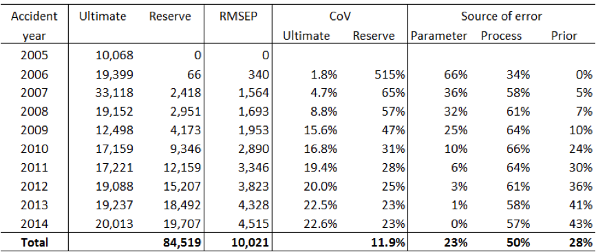

The CoVs by accident year appear much more reasonable than those resulting from the Mack and ODP models. Overall the reserve variability is estimated as 11.9%, compared with 40% (ODP) and 64% (Mack).

The breakdown of RMSEP by parameter, process and prior error behaves as might be expected. Process error makes a significant contribution over all accident years. However parameter and prior errors make different contributions depending on the age of the accident year; for older accident years, the parameter error makes a larger contribution since a greater weight is attached to the chain ladder estimates. For more recent years, the prior error dominates.

#### Source of error for the BF analytic results

Armed with these results, the actuary should then consider whether an additional loading for model error is required. This is particularly important for long-tailed classes where there is often a greater change of environmental changes impacting future claims cost. The same comments as made at the end of 7.1.1 apply – if the actuary considers that no further allowance is required for model error, then the model outputs may be used. If a further allowance is made, then standard practice would be to adjust the reserve CoV accordingly and combine this with a parametric distribution such as the log normal to produce the distribution of outstanding claims.

# Conclusion

The aim of this paper has been to present an introduction to reserve uncertainty estimation using bootstrapping with a focus on three commonly used models in general actuarial practice. It is intended to serve as a guide to the well-established literature on two of these models, the Mack model and Over-Dispersed Poisson model. The third model considered is the Bornhuetter-Ferguson model. Although widely used in practice, the stochastic version and methodology for bootstrapping is less well studied. Given its popularity, we have presented some of our thoughts on how bootstrapping might be carried out, but we note that this area is likely to develop further over coming years.

The Pragmatic Stochastic Reserving Working Party is currently engaged in some work-streams which are intended to complement and supplement the material presented here. These are:

- A practical implementation work-stream: We recognise that having practical hands-on tools to implement the methods here is important to practitioners. Although we have provided an excel template for bootstrapping the Mack model, implementation of these methods is usually more easily carried out in a statistical environment. To that end we have established a work-stream to consider the use of R (a free statistical package) for stochastic reserving. We intend to produce R tools to implement the methods described here. In particular this includes the further research into the use of bootstrapping for the stochastic BF model.
- A one-year view of risk: as discussed in section [Ultimate vs One-Year View of Risk](#Ultimate vs One-Year View of Risk), the one-year view of risk is of considerable interest due to Solvency II requirements. We are currently researching different approaches to this problem.

Looking forward, the Working Party intends to maintain a dynamic version of this document so that it may be updated as new knowledge and experience arises. To that end we welcome feedback on anything covered in this paper, or on any related topics.

# References

<a name="AMW09">[AMW09]</a> Alai, D. H., Merz, M., Wüthrich, M.V., *Mean squared error of prediction in the Bornhuetter-Ferguson claims reserving method*, A.A.S. 4, 7-31.

<a name="AMW10">[AMW10]</a> Alai, Merz, Wüthrich (2010), *Prediction uncertainty in the Bornhuetter-Ferguson claims reserving method: revisited*, A.A.S. 5, I, 7-17

<a name="CGMWZ15">[CGMWZ15]</a> Carrato, Gesmann, Murphy, Wüthrich and Zhang (2015), *Claims Reserving with R: Chainladder-0.2.0 Package Vignette*, CRAN

<a name="BF72">[BF72]</a> Bornhuetter, R.L. and Ferguson, R.E. (1972), *The actuary and IBNR*, Proc. CAS, Vol. LIX, 181-195.

<a name="Ef79">[Ef79]</a> Efron, B. (1979), *Bootstrap methods: another look at the jackknife*, Annals of Statistics. 7, 1-26

<a name="EV02">[EV02]</a> England, Verrall (2002), *Stochastic claims reserving in general insurance*, B.A.J. 8, III, 443-544

<a name="EV06">[EV06]</a> England, Verrall (2006), *Predictive distributions of outstanding liabilities in general insurance*, A.A.S. 1, II, 221-270

<a name="FD14">[FD14]</a> Frees E. W. and Derrig, R. A. (eds.) (2014), *Predictive Modeling Applications in Actuarial Science: Volume 1, Predictive Modeling*. Cambridge University Press, New York, NY, USA.

<a name="GS05">[GS05]</a> Gigante, Sigalotti (2005), *Model risk in claims reserving with generalized linear models*, Giornale dell'Istituto Italiano degli Attuari, Volume LXVIII, 55-87

<a name="Ha66">[Ha66]</a> Harnek, R. F. (1966), *Formula Loss Reserves*, Insurance Accounting and Statistical Association Proceedings

<a name="HS75">[HS75]</a> Hachemeister, C. A. and Stanard, J. N. (1975), *IBNR Claims Count Estimation with Static Lag Functions*, Paper presented to the XIIth ASTIN Colloquium, Portimao, Portgual

<a name="JP94">[JP94]</a> Jorgensen, B. and Paes de Souza, M. C. (1994), *Fitting Tweedie's compound Poisson model to insurance claims data*, Scandinavian Actuarial Journal, 69-93.

<a name="LV08">[LV08]</a> Liu, Huijuan and Verrall, Richard (2008) [*Bootstrap Estimation of the Predictive Distributions of Reserves Using Paid and Incurred Claims*](http://www.actuaries.org/ASTIN/Colloquia/Manchester/Papers\_EN.cfm), Paper presented to the 2008 ASTIN Colloquium, Manchester, United Kingdom. 

<a name="Ma00">[Ma00]</a> Mack, T. (2000), *Credible claims reserves: the Benktander method*, ASTIN Bull., Vol. 30(2), 333-347.

<a name="Ma08">[Ma08]</a> Mack, T. (2008), *The prediction error of Bornhuetter-Ferguson*, ASTIN Bull., Vol. 38(1), 87-103.

<a name="Ma93a">[Ma93a]</a> Mack (1993), *Distribution-Free Calculation of the Standard Error of Chain Ladder Reserve Estimates*

<a name="Ma93b">[Ma93b]</a> Mack, T. (1993), *Which stochastic model is underlying the Chain Ladder method?*, paper presented at the XXIVth ASTIN Colloquium, Cambridge, England.

<a name="Ma97">[Ma97]</a> Mack (1997), *Measuring the variability of Chain Ladder reserve estimates*, Faculty and Institute of Actuaries Claims Reserving Manual, Section D6

<a name="Mc07">[Mc07]</a> McGuire G (2007). [*Individual claim modelling of CTP data*](http://actuaries.asn.au/Library/6.a\_ACS07\_paper\_McGuire\_Individual claim modelling of CTP data.pdf). Institute of Actuaries of Australian XIth Accident Compensation Seminar, Melbourne, Australia. Available at 

<a name="MN89">[MN89]</a> McCullagh P & Nelder J A (1989). *Generalized linear models*, 2nd ed. Chapman & Hall, Boca Raton, USA.

<a name="MV00a">[MV00a]</a> Mack, T. and Venter, G. (2000) *A comparison of stochastic models that reproduce Chain Ladder reserve estimates*. Insur. Math. Econ. Vol. 26 No. 1 pp. 101-107

<a name="MV00b">[MV00b]</a> Mack, T. and Verrall, R. J. (2000) *An investigation into stochastic claims reserving models and the chain-ladder technique*. Insurance: Mathematics and Economics, 17, 43-54

<a name="MW08">[MW08]</a> Merz, M., Wüthrich. M.V. (2008) "Modelling the Claim Development Result for Solvency Purposes", CAS E-Forum, Fall 2008, 542--568.

<a name="OSH05">[OSH05]</a> O'Dowd C., Smith A. and Hardy P. (2005). [*A framework for estimating uncertainty in insurance claims cost*](http://www.actuaries.asn.au/Library/gipaper\_odowd-smith-hardy0510.pdf). XVth General Insurance Seminar, 16-19 October 2005. Institute of Actuaries of Australia.  

<a name="OEL08">[OEL08]</a> Ohlsson, Esbjörn & Lauzeningks (2008), *The one-year non-life insurance risk*, ASTIN Colloquia Manchester

<a name="PSW09">[PSW09]</a> Peters, Shevchenko, Wüthrich (2009), "Model uncertainty in claims reserving within Tweedie's compound poisson models", Astin Bulletin 39(1), 1-33

<a name="RMT08">[RMT08]</a> Risk Margins Taskforce (2008), [*A framework for assessing risk margins*](http://www.actuaries.asn.au/Library/Framework%20for%20assessing%20risk%20margins.pdf), XVIth General Insurance Seminar, 9-12 November 2008. Institute of Actuaries of Australia. 

<a name="RV98">[RV98]</a> Renshaw, A. E. and Verrall, R. J. (1998), *A stochastic model underlying the chain-ladder technique*, B.A.J. 4, IV, 903-923

<a name="Ta86">[Ta86]</a> Taylor, G. C. (1986), *Claim Reserving in Non-Life Insurance*, North-Holland, Amsterdam, 1986

<a name="Ta00">[Ta00]</a> Taylor, G. C. (2000), *Loss Reserving: An Actuarial Perspective*, Kluwer Academic Publishers, Boston

<a name="TM04">[TM04]</a> Taylor G and McGuire G (2004). *Loss reserving with GLMs: a case study*. Casualty Actuarial Society 2004 Discussion Paper program, pp 327-392.

<a name="TM15">[TM15]</a> Taylor G and McGuire G (2015). *Stochastic Loss Reserving using Generalized Linear Models*. CAS monograph series, in press.

<a name="TMS06">[TMS06]</a> Taylor G., McGuire G. and Sullivan, J. (2006). *Individual claim loss reserving conditioned by case estimates*. [Research paper commissioned by the Institute of Actuaries](Available http://www.actuaries.org.uk/research-and-resources/documents/individual-claim-loss-reserving-conditioned-case-estimates).

<a name="Tw84">[Tw84]</a> Tweedie, M.C.K. (1984), *An index which distinguishes between some important exponential families*, Statistics: Applications and New Directions, Proceedings of the Indian Statistical Golden Jubilee International Conference, J. K. Ghosh and J. Roy (Eds.), Indian Statistical Institute, 1984, 579-604.

<a name="Ve04">[Ve04]</a> Verrall, R. J., *A Bayesian Generalized Linear Model for the Bornhuetter-Ferguson Method of Claims Reserving*, North American Actuarial Journal, Vol. 8 No. 3, 67-89.

<a name="WM08">[WM08]</a> Wüthrich, M.V. and Merz, M. (2008), *Stochastic claims reserving methods in insurance*, Wiley & Sons, Chichester.

# Glossary

For convenience, a list of common acronyms or abbreviations used in the paper is presented here.

- ABE: actuarial best estimate
- AY: accident year
- BF: Bornhuetter-Ferguson model
- CL: chain ladder
- CDR: claim development result
- CoV: coefficient of variation
- CY: calendar year (sometimes referred to as payment year)
- DY: development year
- GLM: generalised linear model
- IBNR: incurred but not reported
- IBNER: incurred but not enough reported
- LoB: line of business
- Mack: usually refers to the [Mack model](#Macks Model)
- MSEP: mean square error of prediction
- ODNP: over-dispersed negative binomial distribution
- ODP: usually refers to the [Over-dispersed Poisson model](#Over-dispersed Poisson model), but may occasionally refer to the over-dispersed Poisson probability distribution.
- P-P plot: probability-probability plot
- RMSEP: root mean square error of prediction (ie the square root of the MSEP)
- SBE: stochastic best estimate (usually the central estimate or mean)
- SCR: solvency capital requirement
- Stochastic BF: a stochastic version of the Bornhuetter-Ferguson model
- UY: underwriting year

# Footnotes

[^1]: i.e. as development to Ultimate.

[^2]: The rationale behind this rule of thumb is driven by practical experience, i.e. we observed that good models for short tail lines of business ($d=2$) have around 10 to 15 years of history, whilst long tailed lines ($d=4$) ideally have 20 to 30 years (or more)

[^3]: For example the incremental claims in an ODP model or the link ratios in the Mack model

[^4]: It could be argued that the insurance process is not random, but is instead deterministic given sufficient knowledge of all claims, claimants, claims managing processes etc. In practice this is not possible, so it is reasonable to proceed as though the process is indeed stochastic.

[^5]: Or ODP distribution, if the dispersion parameter isn't assumed as 1.

[^6]: [http://cran.r-project.org/web/packages/ChainLadder/index.html](http://cran.r-project.org/web/packages/ChainLadder/index.html)

[^7]: Section 2.6 - Mack's model

[^8]: Which implies that the sum of the incremental payments in the column _j_ is negative

[^9]: Note that according to the Verrall result, instead of fitting a GLM it is possible to fit directly a **Volume All DFM** to speed up the estimation process during a semi-parametric bootstrap. There, we would recommend avoiding other development factor selection rules other than Volume All, if possible.

[^10]: Note that, as simulating an ODP is not a straightforward task, a Gamma function is often used instead, formulated to have similar properties, as  . This is slightly forced, as a Gamma function should have  .

[^11]: Coefficient of Variation

[^12]: Log-normal or gamma would be natural choices, in order to avoid negative ultimates

[^13]: In other words, it is the ratio between  and its relative accident year ultimate.

[^14]: The library TweedieReserve of the R Chain Ladder opensource package can handle different regression structures. Please refer to [GS05] and [CGMWZ15] for further information.
